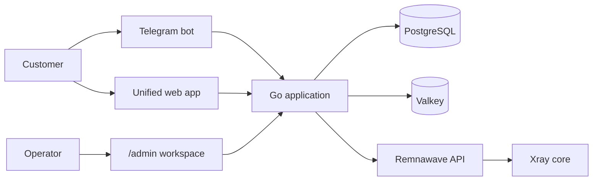

<!-- markdownlint-disable MD013 -->

# 🌊 Omniflow

## The open-source customer and operations platform for Remnawave VPN services

Build Telegram-first self-service, subscriptions, billing, support, marketing, and administration around your existing Remnawave installation—without taking ownership of Xray or duplicating VPN state.

[](./LICENSE)
[](./go.mod)
[](./apps/web/package.json)
[](./package.json)
[](./package.json)
[](https://docs.rw/api/)

[Quick start](#-quick-start) · [Documentation](./docs/index.mdx) · [Architecture](./docs/architecture/overview.mdx) · [Contributing](./CONTRIBUTING.md)

> [!IMPORTANT]
> Omniflow is under active development. The platform foundation and Telegram account dashboard are implemented; billing, purchasing, support conversations, and marketing modules are planned incrementally.

## ✨ Highlights

| | Capability | What it provides |
| --- | --- | --- |
| 🤖 | **Telegram-first experience** | Russian and English self-service with responsive inline navigation, subscription access, traffic, devices, retry states, and support handoff. |
| 🔗 | **Remnawave-native integration** | Targets the official Remnawave 3.2.2 API and keeps Remnawave authoritative for VPN users, traffic, devices, links, nodes, and squads. |
| 🧭 | **One web application** | Customer routes and the `/admin` workspace share Next.js, localization, API bindings, and the same shadcn component system. |
| 🛡️ | **Privacy-conscious by design** | Protected Telegram messages, no HWID/IP display, no subscription-link storage, explicit secret boundaries, and optional anonymous telemetry. |
| 🧱 | **Production-oriented foundation** | PostgreSQL migrations, durable River jobs, transactional outbox, Valkey, generated contracts, structured logs, observability, and security automation. |
| 🧰 | **Contributor-friendly tooling** | Bun workspaces, Biome, TypeScript 7, Orval, sqlc, Atlas, Mintlify, Renovate, Release Please, and Conventional Commits. |

## 🤖 Telegram experience

The current bot gives linked Remnawave customers a clean, single-message dashboard:

- 📊 Subscription status, expiry, remaining days, and traffic progress
- 🚀 Guided connection flow with protected open/copy subscription actions
- 📱 Friendly device summaries without exposing HWIDs or IP addresses
- 🔄 Fast refresh, back navigation, loading feedback, and recoverable errors
- 🌍 Automatic Russian or English localization
- 💬 Configurable support handoff when human help is needed

On first use, Omniflow performs an exact Telegram-ID lookup through Remnawave and persists the numeric user mapping under a concurrency-safe database lock. It never guesses account ownership or offers an insecure self-link.

## 🧩 Clear ownership boundaries



**Remnawave owns:** VPN users, traffic, devices, access links, nodes, squads, and Xray state.

**Omniflow owns:** customer identity, plans, orders, payments, wallet entries, support, campaigns, referrals, loyalty, RBAC, and audit history.

Omniflow never connects to Remnawave storage and never manages Xray processes directly.

## 🛠️ Technology stack

| Layer | Technology |
| --- | --- |
| Backend | Go 1.26, Chi, pgx, sqlc, River, OpenAPI, OpenTelemetry |
| Data | PostgreSQL 18, Atlas migrations, Valkey 9 |
| Telegram | `go-telegram/bot`, localized inline keyboards, long polling |
| Web | Next.js 16.3, React 19, TypeScript 7, SWR, Zustand |
| UI and forms | Tailwind CSS v4, shadcn/ui, React Hook Form, Zod |
| API generation | `oapi-codegen`, Orval Fetch/SWR clients and Zod schemas |
| Tooling | Bun workspaces, Biome, Mintlify, Docker Compose |
| Delivery | GitHub Actions, Renovate, Release Please, Trivy, Gitleaks |

## 🚀 Quick start

### Requirements

- Docker with Compose v2
- A reachable Remnawave 3.2.2 installation
- A Telegram bot token if you want to run bot flows

### 1. Configure the application

```bash
cp .env.example .env
```

Set at least the database, Remnawave, and Telegram values required by the services you want to run. All project-owned environment variables use the `APP_*` prefix.

### 2. Start the backend and bot

```bash
docker compose up --build postgres valkey migrate api bot worker
```

The bot remains disabled when `APP_TELEGRAM_TOKEN` is empty. Check the API at:

```bash
curl http://localhost:8080/healthz
```

### 3. Start the unified web application

```bash
docker compose --profile web up --build
```

- 👤 Customer account: [http://localhost:3000](http://localhost:3000)
- 🧑‍💻 Admin workspace: [http://localhost:3000/admin](http://localhost:3000/admin)
- ❤️ API health: [http://localhost:8080/healthz](http://localhost:8080/healthz)

For complete configuration and deployment guidance, see the [quick-start documentation](./docs/getting-started/quickstart.mdx).

## 🗂️ Repository layout

```text
apps/web/             Unified customer and admin Next.js application
cmd/api/              REST API process
cmd/bot/              Telegram bot process
cmd/worker/           River background worker
internal/botapp/      Telegram navigation, rendering, and identity linking
internal/remnawave/   Versioned Remnawave HTTP adapter
packages/api-client/  Generated Fetch, SWR, and Zod bindings
packages/ui/          Shared shadcn component system
database/             Desired schema, Atlas migrations, and sqlc queries
docs/                 Mintlify documentation
deploy/proxies/       Optional reverse-proxy examples
```

## 🔭 Roadmap

- [x] Go, PostgreSQL, Valkey, Atlas, River, and OpenAPI foundation
- [x] Remnawave 3.2.2 client boundary and exact Telegram account linking
- [x] Telegram subscription, connection, traffic, devices, and support UX
- [x] Unified customer/admin Next.js application and shared components
- [ ] Plans, purchasing, renewals, payments, and wallet ledger
- [ ] Support conversations, notifications, campaigns, and referrals
- [ ] Authentication, RBAC enforcement, audit views, and operator workflows
- [ ] Testcontainers and end-to-end browser coverage
- [ ] Production Telegram webhook mode

## 📡 Anonymous telemetry

Privacy-preserving installation telemetry is enabled by default to help prioritize compatibility and features across the open-source community. It never includes customer identities, Telegram IDs, payment values, VPN traffic, domains, tokens, links, or message content.

Disable all telemetry requests with:

```bash
APP_TELEMETRY_ENABLED=false
```

The exact payload, retention policy, and opt-out behavior are documented in [Anonymous telemetry](./docs/operations/telemetry.mdx).

## 🤝 Contributing

Contributions are welcome. Before opening a pull request:

1. Read [CONTRIBUTING.md](./CONTRIBUTING.md) and [AGENTS.md](./AGENTS.md).
2. Review the [architecture](./docs/architecture/overview.mdx) and ownership boundaries.
3. Run the relevant commands from `make help`.
4. Use a focused [Conventional Commit](https://www.conventionalcommits.org/).

Please report security vulnerabilities privately using [SECURITY.md](./SECURITY.md), not public issues.

## 📄 License

Copyright © 2026 Omniflow contributors.

Licensed under the **Apache License, Version 2.0**. You may use, modify, and distribute this project under the terms in [LICENSE](./LICENSE).
