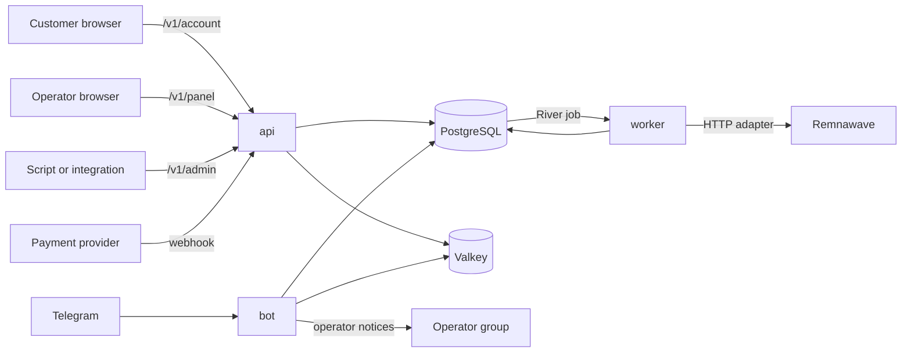

Omniflow is one Go module with three entrypoints — `cmd/api`, `cmd/bot`, `cmd/worker` — built from the
same source tree into three images, plus one Next.js application that carries both browser surfaces. They
share one PostgreSQL database and one Valkey instance. PostgreSQL is the only durable source of truth;
Valkey holds cache, rate-limit counters, locks, and temporary state, and the compose stack runs it with
`--save "" --appendonly no` so nothing is tempted to treat it as storage.

The split between the three processes is about failure isolation and lifetime, not about scale. A batch of
four hundred subscription changes must not be tied to the lifetime of the HTTP request that started it,
and automatic renewals — the one place money moves with nobody watching — run where no request can cancel
them.

## The four processes

| Process | Entry point | Listens on | Owns |
| --- | --- | --- | --- |
| `api` | `cmd/api` | `APP_HTTP_ADDR`, default `:8080` | The HTTP API (`/v1/catalog`, `/v1/payments/webhooks/{provider}`, `/v1/admin`, `/v1/panel`, `/v1/account`), the probes and `/metrics`, maintenance auto-detection, the payment reconciler, the order/wallet/cart maintenance loop, the anonymous telemetry heartbeat, and the first-run admin setup token |
| `bot` | `cmd/bot` | Long polling by default; `APP_BOT_HTTP_ADDR`, default `:8082`, in webhook mode; probes and `/metrics` only if `APP_BOT_METRICS_ADDR` is set | Telegram updates, the operator notification dispatcher, required-channel re-verification, customer notification delivery, and the `/ops` backup and restore surface |
| `worker` | `cmd/worker` | `APP_WORKER_HTTP_ADDR`, default `:8081` | The River job workers (fulfillment, digital-goods delivery), the reconciliation and delivery schedulers, the renewal and dunning loop, the lifecycle sweeper, campaign expansion, the bulk-action runner, retention sweeps, and scheduled encrypted backups |
| `web` | `apps/web` | `3000` | One Next.js application serving the customer panel at `/account` and the operator workspace at `/admin`, backed by one shared shadcn component system |

The three Go images differ only in what they need at runtime: `api` ships on a distroless base, while
`bot` and `worker` ship on Alpine with `postgresql18-client`, because both shell out to `pg_dump` and
`pg_restore`. The web image serves Next.js standalone output from a Node base. See
[Deployment](/operations/deployment).

### What each process refuses to start without

Configuration is read from environment variables once, at startup, and a bad value is fatal rather than
latent. Nothing re-reads the environment, so every change is a restart.

- **`api`** boots with an empty `APP_DATABASE_URL` and then serves only `/healthz`, `/livez`, `/readyz`,
  and `/metrics`. With a database URL set it additionally requires `APP_OPERATOR_TOKEN`, a 32-byte
  `APP_DATA_ENCRYPTION_KEY`, `APP_REMNAWAVE_URL`, `APP_REMNAWAVE_TOKEN`, and `APP_VALKEY_URL`, or it exits
  with `commerce requires APP_OPERATOR_TOKEN, APP_DATA_ENCRYPTION_KEY, APP_REMNAWAVE_URL, APP_REMNAWAVE_TOKEN, and APP_VALKEY_URL`.
- **`bot`** with an empty `APP_TELEGRAM_TOKEN` logs `telegram bot disabled because APP_TELEGRAM_TOKEN is empty`
  and idles until it is signalled — that is a supported configuration, not an error. With a token it
  requires `APP_DATABASE_URL`, `APP_VALKEY_URL`, `APP_REMNAWAVE_URL`, and `APP_REMNAWAVE_TOKEN`. Valkey is
  mandatory here because rate limiting and callback replay protection both guard money-moving taps.
- **`worker`** requires `APP_DATABASE_URL`, `APP_REMNAWAVE_URL`, and `APP_REMNAWAVE_TOKEN`.
  `APP_DATA_ENCRYPTION_KEY` is optional: without it the worker logs `digital goods delivery disabled` and
  runs everything else.

The complete list is in [Configuration](/getting-started/configuration).

## How a request travels

Every entry point lands in PostgreSQL first. Only the worker talks to Remnawave on a write path, and it
does so from a durable job rather than from a request.

A purchase makes the shape concrete:

<Steps>
  <Step title="The customer picks a plan">
    In the browser this is `/account` and the `/v1/account/checkout` routes; in Telegram it is the bot's
    catalogue screens. Both create an ordinary order row.
  </Step>
  <Step title="A payment intent is created">
    The order gets an intent against one provider adapter. The customer is sent to the provider, or pays
    in Telegram, or the order settles against their wallet balance.
  </Step>
  <Step title="The provider calls back">
    `POST /v1/payments/webhooks/{provider}` is unauthenticated by necessity and protected by signature
    verification over the exact bytes the provider sent. A duplicate provider event resolves to
    `{"status":"duplicate"}` rather than settling twice.
  </Step>
  <Step title="Settlement, entitlement, and job commit together">
    In one transaction the API marks the order paid, writes the entitlement, creates the
    `fulfillment_operations` row with idempotency key `order:<orderID>:fulfill`, writes an `order.paid`
    outbox event, grants any referral reward, and inserts the River job.
  </Step>
  <Step title="The worker provisions">
    The `fulfillment` worker picks the job up, opens a serializable transaction, locks the operation row,
    and calls Remnawave. On success the previous entitlements of that subscription are superseded and the
    order moves to `fulfilled`.
  </Step>
  <Step title="The customer sees access">
    The access link is read live from Remnawave on every request. It is never stored in Omniflow.
  </Step>
</Steps>

If the provider callback commits and the Remnawave call then fails, the money is recorded, the entitlement
exists, and there is a job with work left to do. That is the failure the transaction boundary is drawn
for. [Fulfillment](/commerce/fulfillment) covers the retry, snooze, and drift behaviour.

## Three API prefixes, three trust models

The HTTP API is split into three prefixes that never share a router.

| Prefix | Credential | Extra gates | Mounted when |
| --- | --- | --- | --- |
| `/v1/panel` | `__Host-omniflow_admin` session cookie | `X-CSRF-Token` on unsafe methods, an RBAC permission declared at each route mount, TOTP challenge state, `X-Operator-Reason` on the mutations that require it | `APP_ADMIN_PANEL_ENABLED=true` and an admin service is attached |
| `/v1/admin` | `Authorization: Bearer <APP_OPERATOR_TOKEN>` | None: no CSRF, no RBAC, no authorization audit | Always, once the commerce runtime is built |
| `/v1/account` | `__Host-omniflow_account` session cookie | `X-CSRF-Token` on unsafe methods, step-up re-authentication on the irreversible actions | `APP_CUSTOMER_PANEL_ENABLED=true` |

Merging any two would mean one silently inheriting the other's middleware, and a customer credential must
never be able to reach an operator route. Keeping them structurally apart makes that a property of the
route table rather than a check somebody has to remember; a test asserts that the customer router answers
`404` for `/v1/panel/auth/session`, `/v1/admin/orders`, and `/v1/panel/admins`.

A prefix whose service is not attached is **absent** — `404`, not `503` — because a `503` would tell an
anonymous caller what the operator has configured. The exception is the pre-sign-in routes, which answer
`503 panel_unavailable` or `503 account_unavailable`, since they run before any credential exists.

The process-wide middleware applies to all three: request ID, panic recovery, a 60-second handler timeout,
OpenTelemetry, and metrics. `/v1/admin` is an external automation surface — nothing in this repository
calls it, and the bot talks to PostgreSQL and Remnawave in process rather than over HTTP. See
[Integrating with the API](/integrations/api).

The web route boundary is organizational, not a security boundary. Authorization is enforced in the Go API
on every request, and `/admin` server components check the same permissions before rendering; a separate
hostname or hidden navigation is never sufficient authorization. The permission catalogue and role mapping
are compiled into `internal/rbac`, so the panel renders from exactly the set the API enforces and a
database edit cannot widen access.

## A state change and its durable job commit together

The rule in `AGENTS.md` is short: *enqueue durable River jobs in the same PostgreSQL transaction as the
state change that requires them*. That is what makes "a paid order always has a job waiting for it" true
rather than hopeful, and an integration test exists whose entire point is that property.

The enqueue hook is a function passed into the commerce store at process start, so the same settlement
code path is transactional in the API and in the worker. The bot deliberately passes no hook: it creates
orders and payment intents, but provisioning belongs to the worker and settlement is committed by the
process that received the callback.

Retrying is safe because the durable record, not the queue, carries identity. `fulfillment_operations`
has a `UNIQUE` idempotency key, and creating one is `ON CONFLICT (idempotency_key) DO UPDATE … RETURNING`,
so a replay reads back the operation that already exists. Reusing a key with different parameters is
refused outright with *idempotency key was already used with different fulfillment parameters*. The known
key shapes are `order:<orderID>:fulfill`, `order:<orderID>:addon`, `gift:<giftID>:fulfill`,
`reconcile:<entitlementID>:<15-minute bucket>`, `panel:<subscriptionID>:<operation>:<requestID>`, and
`bulk:<operationID>:<position>`.

There are exactly two job kinds — `fulfillment` and `goods_delivery` — both on the `critical` queue with
`MaxAttempts: 12` and uniqueness by job arguments. The three configured queues are `critical` (16
workers), `default` (32), and `bulk` (8). Both workers are registered only in the worker process; the API
creates a River client for inserting.

<Note>
  River's own tables — `river_job`, `river_leader`, `river_client`, `river_queue`, `river_migration` — are
  not created by anything in this repository. No committed migration under `database/migrations/` defines
  them, no Go file imports `rivermigrate`, and the compose `migrate` service runs Atlas over Omniflow's
  own schema only. Provisioning the queue schema is not currently part of the documented deployment.
</Note>

## The transactional outbox

Three topics are written to `outbox_events` inside the transaction that caused them: `order.paid`,
`wallet.credited`, and `addon.purchased`. The row carries a topic and a payload and is written with the
same all-or-nothing guarantee as the state change beside it.

Nothing dispatches them. No code path sets `outbox_events.published_at`; the only statements that touch
the column are two `WHERE published_at IS NULL` reads and the retention delete, which matches
`published_at IS NOT NULL`. In practice that means the outbox is a durable record of what happened rather
than a delivery mechanism: `GET /v1/admin/outbox` reports a `pendingCount` that only grows,
`APP_RETENTION_OUTBOX_DAYS` removes nothing, and the panel's outbox tab at
`GET /v1/panel/system/outbox` shows topic and age only — never the payload, which can name a customer and
an amount.

## Loops that are deliberately not jobs

Fourteen ticker-driven loops run as goroutines inside the three processes: order and cart maintenance,
payment reconciliation, maintenance probing, the telemetry heartbeat, reconciliation and delivery
scheduling, renewals, the lifecycle sweeper, campaign expansion, the bulk runner, retention, backups,
channel membership, and the operator notification drain.

They are not River jobs because each is a whole-table pass that is safe to repeat and carries no
per-record argument, so a durable queue would add a row and a retry policy to something a ticker already
expresses. Two properties recur: a failing pass never stops the others, and every pass is idempotent, so a
sweep that runs twice reaches the same state as one that ran once. Only the maintenance, retention, and
backup intervals are configurable; the rest are compiled in. The inventory is in
[Jobs and queues](/operations/jobs-and-queues).

## Supported topology

Run one instance of each process. River coordinates its own queues through leader election, but every
ticker loop listed above is a plain in-process timer with no advisory lock or lease. Two workers means two
of every sweep, two APIs means two maintenance controllers and two payment reconcilers, and two bots means
two notification drains.

The compose stack declares no `restart:` policy on `postgres`, `valkey`, `api`, `bot`, `worker`, or `web`;
only the Traefik overlay sets one. A crashed process stays down until somebody notices, which is what the
probes and [Observability](/operations/observability) are for.

## Why a modular monolith

`AGENTS.md` states the rule — *keep the Go application a modular monolith with independent `api`, `bot`,
and `worker` entrypoints* — and four supporting constraints make it hold:

- Domain packages must not import transport, database-generation, Telegram, or provider-specific
  packages. The dependency arrows point one way.
- External systems sit behind small interfaces. Remnawave is reached only through `remnawave.Service`,
  `remnawave.Provisioner`, and `remnawave.Importer`, so the only Remnawave-shaped types in the codebase
  live in one package.
- Domain events go through the transactional outbox, and no message broker is introduced without an
  accepted architecture decision.
- Dependency construction stays explicit, with no dependency-injection framework until wiring complexity
  demands one.

What an operator gets out of that: one database, one migration set, one `.env`, and three containers to
run. What a contributor gets: a change that spans checkout, entitlement, and provisioning is one
transaction and one test, not a distributed protocol. This supports hundreds of independent installations
without imposing a broker, Kubernetes, or a plugin runtime on any of them.

## Where to go next

<CardGroup cols={2}>
  <Card title="Data ownership" icon="scale-balanced" href="/architecture/data-ownership">
    The exact Remnawave boundary: what each system is authoritative for, and what breaks when that is
    violated.
  </Card>
  <Card title="Technology" icon="layer-group" href="/architecture/technology">
    Every component of the stack and the reason it is there.
  </Card>
  <Card title="Jobs and queues" icon="list-check" href="/operations/jobs-and-queues">
    Job kinds, retries, dead letters, scheduled loops, and retention sweeps.
  </Card>
  <Card title="Deployment" icon="server" href="/operations/deployment">
    Compose topology, volumes, migrations, and upgrades.
  </Card>
</CardGroup>
