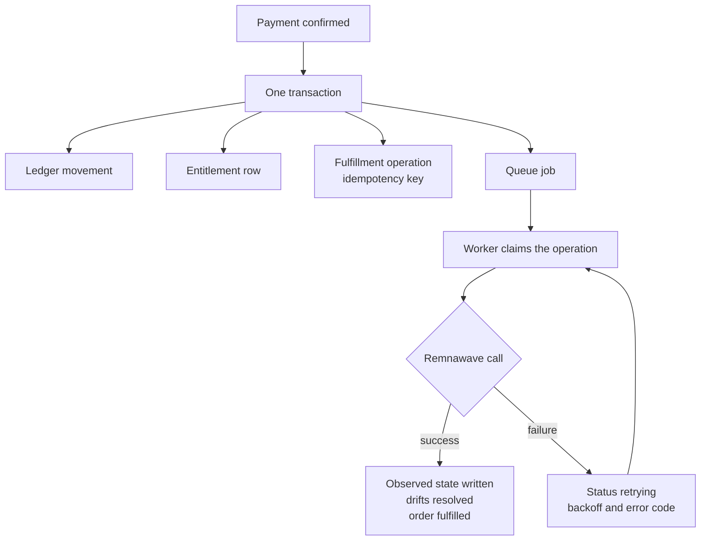

Fulfillment is the part of Omniflow that turns money into access. A customer pays, an entitlement
records what was bought, and a durable operation pushes that state into Remnawave. Those are three
separate records on purpose: payment state, entitlement state, and Remnawave state fail
independently, and collapsing them into one would mean a panel outage could lose a payment.

Omniflow never writes Remnawave storage. Every change it makes to a VPN user is an HTTP call to the
panel's supported API, described in [Remnawave integration](/integrations/remnawave). What this page
covers is the machinery in between: the operation record, its idempotency key, its retry schedule,
the reconciliation sweep that repairs divergence, and the dead-letter path an operator uses when a
run has stopped recovering on its own.

## The four records

| Table | What it holds |
| --- | --- |
| `entitlements` | What Omniflow owes for one order: plan version, period, traffic, device limit, squads, plus the last observed Remnawave state |
| `fulfillment_operations` | One durable, idempotent instruction to push that state into Remnawave |
| `fulfillment_history` | One row per attempt, carrying a safe summary and a classified error code |
| `entitlement_drifts` | One observed divergence between what Omniflow wants and what Remnawave holds |

An entitlement is `UNIQUE (order_id)`, so one order can never mint two of them, and
`CHECK (ends_at > starts_at)` makes a zero-length or negative period unrepresentable. Its status is
one of `pending`, `active`, `limited`, `disabled`, `expired`, `superseded`, or `failed`. Only
`pending` and `superseded` are written locally: `pending` is the gap between settlement and the first
successful push, `superseded` is stamped on the previous entitlement of the same subscription once a
replacement is provisioned. Every other value is read back from Remnawave — `ACTIVE` becomes
`active`, `LIMITED` becomes `limited`, `DISABLED` becomes `disabled`, `EXPIRED` becomes `expired`,
and a status Omniflow does not recognise becomes `failed` rather than being guessed at.

<Note>
  An entitlement never becomes `expired` on a timer. The phase a customer sees is computed from
  `ends_at` at read time; the stored status changes only when a reconciliation pass reads `EXPIRED`
  back from the panel. See [Subscriptions](/commerce/subscriptions) for the phase ladder.
</Note>

## From a paid order to working access

Nobody creates an entitlement by hand. It is written by the settlement path inside the transaction
that marks an order paid, and the fulfillment job is inserted in that same transaction.

That the job is inserted transactionally is the whole point: the ledger movement, the entitlement,
the operator notice, and the durable provisioning intent either all commit or none do. An
integration test exists whose only job is to assert that property, because "we insert the job right
after the commit" is an ordering convention that a crash breaks and an invariant that it cannot.

On success, the worker writes the observed Remnawave state onto the entitlement and the
subscription, resolves any open drifts for that entitlement, and — for a `create` — supersedes the
previous entitlements of that same subscription and moves the order to `fulfilled`. A customer's
second subscription therefore never retires the first one's entitlement.

## The operation set

Eight operations exist, enforced both by a database `CHECK` and by an allow-list in the service that
enqueues them.

| Operation | What the worker calls |
| --- | --- |
| `create` (no known remote user) | `GET /api/users/by-username/{candidate}` for each candidate; on `404` for all, `POST /api/users/` |
| `create` (known remote user) | `PATCH /api/users/`; a `404` falls back to the create-or-recover path |
| `extend`, `set_limits`, `set_squads` | `PATCH /api/users/` |
| `enable` | `POST /api/users/{id}/actions/enable`, then re-read the user |
| `disable` | `POST /api/users/{id}/actions/disable`, then re-read |
| `reset_traffic` | `POST /api/users/{id}/actions/reset-traffic`, then re-read |
| `reconcile` | Compare first, then the same path as `create` |

Anything outside that set is cancelled permanently rather than retried, because an operation the
worker cannot perform will not become performable by waiting.

### The deterministic username, and recovering a remote user

A subscription's Remnawave user is named `omniflow_` followed by the first sixteen hex characters of
the subscription's UUID. Installations upgraded from v0.4 additionally accept a legacy name derived
from the *customer* UUID for slot 1.

This prevents two distinct failures. A `create` retried after a lost response must not mint a second
Remnawave user, so the worker looks the username up before creating one. And an installation that
already had Remnawave users must adopt them rather than duplicate them, which is why slot 1 tries
both candidates. Deriving the name from the subscription rather than the customer is precisely what
lets one customer own several independent Remnawave users.

A subscription in slot 2 or higher with no stored mapping returns *no* remote user rather than
falling back to the customer-level one, so a second subscription can never be confused with the
first one's remote state. A non-`create` operation in that position fails with
`remote_user_not_found` and retries: you cannot `enable` something that was never provisioned.

## Idempotency

Every operation carries an idempotency key that is `UNIQUE` on the table. Inserting a duplicate key
reads the existing operation back rather than creating a second one.

| Key | Written by |
| --- | --- |
| `order:<orderID>:fulfill` | A settled purchase, renewal, upgrade, or downgrade |
| `order:<orderID>:addon` | A mid-period add-on, folded into one `set_limits` |
| `gift:<giftID>:fulfill` | A claimed gift |
| `reconcile:<entitlementID>:<15-minute bucket>` | The reconciliation sweep |
| `panel:<subscriptionID>:<operation>:<requestID>` | An operator action in the panel |
| `bulk:<operationID>:<position>` | One item of a bulk operation |

Reading the row back is not enough on its own, so the service then re-verifies the parameters. Reusing
a key with a different entitlement, operation, effective instant, end instant, traffic allowance,
device limit, or squad set is refused with *"idempotency key was already used with different
fulfillment parameters"*. A key is a promise that this is the same instruction, and silently applying
a different one under an old key is the failure that promise exists to prevent.

Two further refusals happen before anything is queued:

- `extend` requires an `endsAt` that is strictly later than the entitlement's current end. Extending
  to an earlier instant would shorten what the customer bought.
- A negative traffic allowance or device limit is refused outright.

## Retries, backoff, and permanent failure

The job runs in a `Serializable` transaction and takes `SELECT … FOR UPDATE` on the operation row, so
two workers cannot apply the same operation at once. An operation already `succeeded` or `cancelled`
commits and does nothing.

Each failure writes the operation back to `retrying` with the classified error code and a recorded
next-attempt time of `5s × 2^min(attempt, 8)` — five seconds, then ten, twenty, and so on to a
ceiling of 1280 seconds. The queue allows the job twelve attempts before it stops retrying on its
own. The operation row keeps the status `retrying` and its last error code when that happens, which
matters when you go looking for it — see [the dead-letter path](#the-dead-letter-path). It is not
abandoned: the [revival scan](#revival-of-stalled-operations) inserts a fresh job for it once it has
sat for ten minutes past its recorded next attempt, so a Remnawave outage longer than the twelve
attempts costs a delay rather than a manual retry.

| Error code | Meaning |
| --- | --- |
| `remote_user_not_found` | Remnawave returned `404` for the user this operation names |
| `remnawave_http_<status>` | The panel answered with that status |
| `remnawave_unavailable` | The call did not complete — timeout, connection failure, unreadable response |
| `invalid_desired_state` | The stored desired state could not be decoded |
| `maintenance_active` | Provisioning is held, not failed |

Errors are classified rather than stored as free text, so a dead-letter list can be read at a glance
and an operator is never handed a provider payload.

Two outcomes are not retries:

- A malformed `desired_state` fails **permanently**. The operation moves to `failed`, an operator
  notice is queued, and the job is cancelled. Retrying a message the worker cannot parse would only
  produce the same parse failure twelve times.
- An `effectiveAt` in the future **snoozes** the job until that instant instead of consuming an
  attempt. This is how an `at_expiry` downgrade waits for the current period to end without
  occupying a worker.

After three failed attempts an operator notification of kind `fulfillment_failure` is queued inside
the worker's own transaction, so it exists exactly when the failure is durable. It is deduplicated on
`operation:<operationID>`, which means one struggling entitlement produces one message however many
times it retries. It carries the entitlement ID, the operation, the classified error code, and the
status — never a Remnawave response body, an access link, or customer content. Delivery is described
in [Operator notifications](/operations/operator-notifications).

### When Remnawave is unreachable

Nothing is lost and nothing is refunded. The payment is already recorded, the entitlement already
exists, and the operation sits in `retrying` with `last_error_code = "remnawave_unavailable"` until
the panel answers. The customer sees the subscription in a `provisioning` phase rather than an error,
and the customer web panel marks its live figures `degraded` rather than presenting stale numbers as
current.

A prolonged outage usually triggers [maintenance mode](/operations/maintenance-mode) instead, which
changes the behaviour deliberately.

## Maintenance mode holds provisioning

While maintenance is active, `Blocks(ActionFulfillment)` is true and the worker holds the operation
rather than running it. The check happens *after* the operation is claimed: the worker rewinds the
attempt count so the pause does not consume a retry, records `maintenance_active`, sets the status to
`retrying` with the next attempt one minute out, commits, and snoozes the job for a minute.

Holding provisioning without losing it means an outage costs a delay rather than an entitlement.
Purchases are blocked at the same time, so no new money enters an installation that cannot provision;
money already taken is untouched, and settlement, refunds, and order history keep working.

## Scheduled reconciliation

Every fifteen minutes the worker process enqueues a `reconcile` operation for up to 500 entitlements
whose `reconciled_at` is null or older than fifteen minutes. This is the self-healing loop: it
detects divergence, recreates a remote user somebody deleted, re-pushes the desired expiry, traffic,
device limit, and squad set, and refreshes the `observed_state` that the panel and the customer
surfaces read.

- The idempotency key is `reconcile:<entitlementID>:<bucket>`, where the bucket is the current time
  truncated to fifteen minutes. Two passes inside one bucket converge on a single operation.
- The correlation ID is `scheduler:<bucket>`, which is how a reconciliation attempt is told apart
  from a purchase-driven one in the history view.
- The desired state is rebuilt from the entitlement row itself and carries no `effectiveAt`, so a
  reconcile never snoozes.
- `pending` entitlements are **not** selected. They are still waiting on their first `create`, and
  the sweep is not a substitute for it.
- `reconciled_at` is stamped only after a successful apply, so a permanently failing entitlement is
  re-queued in every bucket and produces one new operation row per fifteen minutes.

The interval and the batch size are hard-coded. There is no environment variable for either.

<Warning>
  Reconciliation and provisioning run only in the worker process. An installation running the API and
  the bot without `cmd/worker` takes payments and never provisions anything.
</Warning>

### Revival of stalled operations

Every five minutes the same worker loop looks for operations that should have run and have not: rows
in `pending` or `retrying` whose creation time and recorded `next_attempt_at` both lie more than ten
minutes in the past. For each one it inserts a `fulfillment` job with the same arguments and the same
uniqueness options the original settlement used.

The insert is what makes the scan safe to run blindly. River enforces uniqueness on the operation
ID across queued, scheduled, running, retryable, and completed jobs, so an operation whose job is
merely waiting out its backoff gets nothing new; only an operation with no live job — one whose
settling process had no job inserter, or one whose job was discarded after its twelfth attempt —
receives one. The window is measured from the attempt the worker itself scheduled, never from the
operation's age, so a retry at the backoff ceiling is not mistaken for an orphan.

Two consequences are worth knowing:

- A settlement that closes inside the bot — a Telegram Stars payment, an order the wallet covered,
  a trial, a claimed gift or access code — inserts its job in the paying transaction exactly as the
  API does. Should a process ever settle without one, this scan provisions the customer within about
  fifteen minutes rather than never.
- A run that exhausted its twelve attempts is retried again once Remnawave is back, with a fresh
  attempt budget. An operation that keeps failing therefore keeps being retried every quarter hour or
  so until an operator cancels it; the `fulfillment_failure` notice is deduplicated on the operation,
  so that produces one message, not one per revival.

## Drift detection

A `reconcile` compares the entitlement's desired state against what Remnawave actually holds and
records each divergence as a row in `entitlement_drifts` with `expected` and `observed` JSON.

Remnawave is a panel a human can edit. Somebody extending a user by hand, deleting one, or changing a
device limit produces a system that disagrees with itself, and the customer usually notices before
the operator does. Recording the divergence before correcting it gives an operator an explanation
rather than a silent overwrite.

| Kind | Detected when |
| --- | --- |
| `missing_remote` | No known remote user, or `GET /api/users/{id}` returns `404` |
| `expiry` | The remote expiry instant differs from the desired end |
| `traffic` | A configured allowance differs from the remote traffic limit |
| `device_limit` | A configured limit differs from the remote device limit, including a remote null |
| `squads` | The remote active squad set differs from the desired set, compared order-insensitively |
| `status` | The mapped remote status differs from the stored entitlement status |

One open drift per `(entitlement_id, kind)` is enforced by a partial unique index; a repeat detection
refreshes `expected`, `observed`, and `detected_at` rather than piling up rows. Drift is always
evaluated against the Remnawave user *this* subscription owns.

<Note>
  **An empty drift list is normal, not proof that nothing ever drifted.** In a successful reconcile
  pass the same transaction that opens the drift rows closes them once the corrective `PATCH`
  succeeds. A drift stays open only while corrective work is failing or Remnawave stays unreachable.
  Read **/admin → System → Drift** as "what is currently unrepairable", not as a change log of the
  panel.
</Note>

`external_edit` appears in the table's `CHECK` constraint and in the API schema but is never written
by any code path. What an externally modified user actually produces is the specific field drift —
`expiry`, `traffic`, `device_limit`, `squads`, or `status`.

If the comparison itself fails for a reason other than a `404` — a panel read error — a `retrying`
history row is written and the job retries without applying anything, so a bad read never becomes a
bad write.

Resolved drift rows older than `APP_RETENTION_DRIFT_DAYS` (default `90`) are deleted by the retention
sweep. Open ones are never deleted.

## Operator-requested changes

From a customer's profile an operator with `subscriptions.write` can queue a change against one
subscription. It goes through the fulfillment pipeline rather than calling Remnawave directly, so an
operator change carries the same idempotency key, retry policy, drift detection, and history as one a
purchase produced. A panel click that wrote to Remnawave itself would be the one change
reconciliation could not explain.

<Steps>
  <Step title="Open the customer">
    Go to `/admin/customers`, find the customer, and open their profile. Each subscription card
    carries its own actions panel.
  </Step>
  <Step title="Type a reason">
    The reason field is mandatory. Until it has content the action buttons stay disabled, and the
    service refuses the request with a validation error if one arrives without it. The reason is what
    the audit event records; the operation row does not carry it.
  </Step>
  <Step title="Choose the action">
    **Enable**, **Disable**, and **Reset traffic** need nothing further. **Extend** needs an "ends at"
    datetime. **Set limits** needs a traffic figure in bytes, a device limit, or both.
  </Step>
  <Step title="Read the result">
    The panel reports **queued**, not done, because the worker is what applies it. Watch the outcome
    under **/admin → System → Jobs**.
  </Step>
</Steps>

The route is `POST /v1/panel/customers/{customerID}/subscriptions/{subscriptionID}/operations`, which
returns `202` with `{operationId, operation, status}` and writes an audit event
`panel.subscription.<operation>`.

Its refusals are worth knowing:

- `create` and `reconcile` are deliberately **not** offered. Allowing them would give an operator a
  way to mint an entitlement with no order behind it, or to race the reconciliation sweep. Asking for
  one returns `422 unsupported_operation`.
- A subscription slot that has never been provisioned returns `409 not_provisioned`.
- The subscription is always resolved *through* the customer named in the path, so an operator who
  guessed a subscription identifier cannot act on a customer they are not looking at.
- The idempotency key includes the request identifier, so a double-submitted form reuses the first
  operation instead of queueing a second Remnawave change.

`set_squads` is accepted by the API but has no control in the panel form; the panel offers enable,
disable, reset traffic, extend, and set limits.

For many subscriptions at once, use the bulk operations described in
[Admin operations](/operations/admin-operations); they enqueue the same operations with a
`bulk:<operationID>:<position>` key so a runner restarted mid-batch cannot extend a subscription
twice.

## The dead-letter path

Two overlapping surfaces exist, and the difference between them matters.

**/admin → System → Jobs** works on `fulfillment_operations` rows and loads with `status=failed`.
Each row shows the creation time, the operation, the attempt count, the classified error code, and
the correlation ID. With `system.write` an operator gets **Retry** and **Cancel**; the history view
lists each attempt with its status, correlation ID, and error code. Neither action requires a reason,
unlike the subscription operations above, and both write an audit event
(`panel.fulfillment.retried`, `panel.fulfillment.cancelled`).

<Note>
  **`failed` is narrower than "gave up".** The only thing that writes `status = 'failed'` is a
  permanent failure — an operation whose desired state could not be decoded. A run that simply
  exhausted its twelve attempts is left in `retrying` with its last error code. Query
  `GET /v1/panel/system/jobs?status=retrying` to see those, and
  `?entitlementId=` to see everything for one entitlement. Both Retry and Cancel accept a `retrying`
  operation, so the actions work either way; it is only the default filter that will not show it.
</Note>

| Endpoint | Permission | Effect |
| --- | --- | --- |
| `GET /v1/panel/system/jobs?status=&operation=&entitlementId=&cursor=&pageSize=` | `system.read` | Cursor-paged operations |
| `GET /v1/panel/system/jobs/{operationID}/history` | `system.read` | Attempts for one operation |
| `POST /v1/panel/system/jobs/{operationID}/retry` | `system.write` | `failed` or `retrying` → `pending`, clears the error code |
| `POST /v1/panel/system/jobs/{operationID}/cancel` | `system.write` | `pending`, `retrying`, or `failed` → `cancelled` |
| `GET /v1/admin/jobs?state=dead_letter\|retryable\|running\|available\|scheduled\|completed&limit=` | Operator token | Queue rows |
| `POST /v1/admin/jobs/{jobID}/retry`, `POST /v1/admin/jobs/{jobID}/cancel` | Operator token | Re-runs or cancels the queue job |

A `succeeded` operation is neither retryable nor cancellable, and the restriction lives in the SQL
`WHERE` clause rather than in Go, so it cannot be bypassed by a handler change. Neither action can
alter the idempotency key, which is what makes a retry safe: it is the same operation the worker
already knows how to perform exactly once.

The stored `request_summary` and `response_summary` are never returned by either surface. They exist
for the worker and can contain a subscription link. Queue-level errors are passed through the
redactor before leaving the process, and job arguments are summarised rather than echoed.

<Note>
  **The panel's Retry moves the row; the revival scan re-runs it.**
  `POST /v1/panel/system/jobs/{id}/retry` sets the operation back to `pending` with a fresh
  `next_attempt_at` and writes an audit event. It does not insert a queue job itself; the
  [revival scan](#revival-of-stalled-operations) does that once the row has sat for ten minutes, so
  expect the re-attempt within about fifteen minutes. The retry that re-runs a job immediately is
  `POST /v1/admin/jobs/{jobID}/retry` on the operator-token surface.
</Note>

## The queue schema

Fulfillment jobs are River jobs on the `critical` queue, with `MaxAttempts: 12` and uniqueness by job
arguments so a duplicate insert is a no-op.

<Warning>
  No migration under `database/` creates River's own job tables, and nothing in the repository runs
  River's migrator. `atlas migrate apply` therefore brings up every Omniflow table and no queue
  schema, and an insert into the queue — including the one inside the settlement transaction — has
  nothing to write to. Plan for the queue schema to be present in the database before the worker is
  expected to provision anything.
</Warning>

## What fulfillment records, and what it never records

Every attempt writes a `fulfillment_history` row carrying a deliberately narrow summary: the end
instant, whether a traffic limit was configured, whether a device limit was configured, and a squad
*count*. Never squad identifiers, never an access link, never a provider body. There is a unit test
asserting that the summary contains no squad identifiers, because the summary is the thing an
operator reads most often and the easiest place for a credential to leak into a screen.

Metrics are emitted as `omniflow_jobs_total{kind="fulfillment",outcome}` and
`omniflow_job_duration_seconds`; see [Observability](/operations/observability).

## Configuration

| Variable | Default | Purpose |
| --- | --- | --- |
| `APP_REMNAWAVE_URL` | — | Panel base URL; required by the API, bot, and worker |
| `APP_REMNAWAVE_TOKEN` | — | Panel bearer token; required by the same three processes |
| `APP_RETENTION_DRIFT_DAYS` | `90` | How long resolved drift rows are kept |

Everything else in this page is fixed in code: the reconciliation interval (15 minutes), its batch
size (500), the queue's attempt ceiling (12), the backoff ceiling (1280 seconds), the operator-alert
threshold (3 attempts), the maintenance snooze (1 minute), the Remnawave request timeout (10 seconds),
and the 1 MiB cap on a Remnawave response body. None of them is exposed as an environment variable.

## Related pages

<CardGroup cols={2}>
  <Card title="Subscriptions" icon="repeat" href="/commerce/subscriptions">
    Entitlement phases, concurrency, upgrade and downgrade arithmetic.
  </Card>
  <Card title="Remnawave integration" icon="plug" href="/integrations/remnawave">
    The adapter, every call it makes, and the contract test that pins them.
  </Card>
  <Card title="Jobs and queues" icon="list-check" href="/operations/jobs-and-queues">
    Job kinds, dead letters, scheduled loops, and retention sweeps.
  </Card>
  <Card title="Maintenance mode" icon="wrench" href="/operations/maintenance-mode">
    What is blocked, what keeps working, and how auto-detect decides.
  </Card>
</CardGroup>
