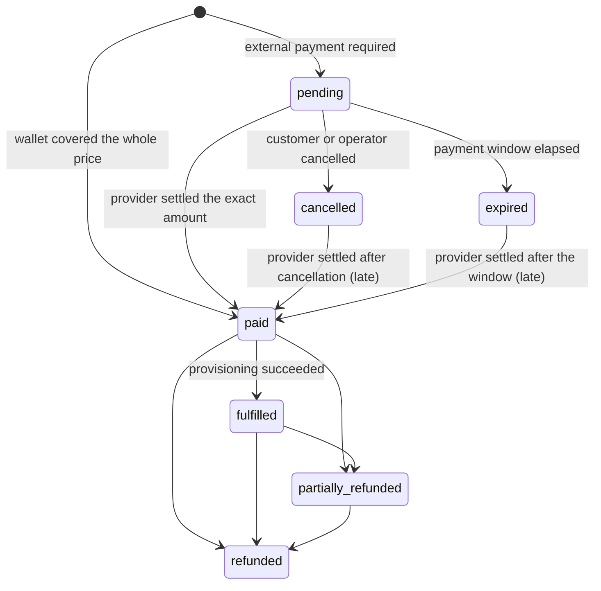

Every purchase in Omniflow is an `orders` row. A subscription, a plan change, a wallet top-up, a
mid-period add-on, a gift, a digital-goods purchase and an unattended renewal all use the same
record, the same payment intents, the same webhook intake, the same reconciliation and the same
refund path. The alternative — a second money path for top-ups, a third for the shop — would be a
second and a third place to get idempotency wrong, and the migration comments say so where the
`topup` and `goods` operations were added.

What differs between operations is only what settlement produces: an entitlement, wallet credit, a
delivery row, or a claimable gift. Everything before that point is shared.

## One record, nine operations

`orders.operation` names what is being bought. The set is a table CHECK, so an unknown operation
cannot be written at all.

| Operation | What it buys | What settlement produces |
| --- | --- | --- |
| `purchase` | a new subscription | entitlement + fulfillment operation |
| `upgrade` | a move to a larger plan | entitlement, per the plan's upgrade policy |
| `downgrade` | a move to a smaller plan | entitlement, per the plan's downgrade policy |
| `extension` | more time on the current plan, asked for by the customer | entitlement extended from the current end |
| `renewal` | the same, charged automatically | entitlement extended from the current end |
| `topup` | wallet credit | a ledger credit and nothing else |
| `addon` | mid-period capacity on a live subscription | add-on capacity folded into the entitlement |
| `gift` | a subscription, add-on or credit for somebody else | a claimable gift |
| `goods` | Telegram Premium or Stars | one delivery row |

`renewal` was split out of `extension` on purpose. Support answers "why was I charged?" from this
column, and the honest answer differs between a change a customer asked for and a charge that
happened while they were asleep. See [Recurring payments](/commerce/recurring-payments).

### The amounts on an order

| Column | Meaning |
| --- | --- |
| `subtotal_minor` | the plan price plus any add-on lines, or the requested top-up amount |
| `discount_minor` | the promotion discount, never more than the subtotal |
| `wallet_minor` | credit taken from the customer's wallet |
| `external_minor` | what a payment provider must settle |
| `paid_minor` | the wallet part plus what the provider actually settled |
| `refunded_minor` | refunded so far, never more than `paid_minor` |

The load-bearing constraint is `wallet_minor + external_minor = subtotal_minor - discount_minor`.
It is a table CHECK rather than an application rule, so no script, backfill or future code path can
write an order whose parts do not add up. All amounts are integer minor units with an uppercase
three-letter currency; there is no floating point anywhere on the wire or in the schema.

## The state machine

An order has eight states.



The three questions the states keep apart are: has money been taken (`paid`), has the thing been
delivered (`fulfilled`), and has money been given back (`partially_refunded`, `refunded`).
Fulfilment is a separate state from payment because provisioning into Remnawave is a retryable,
asynchronous operation that can fail after the money has already arrived — see
[Fulfillment](/commerce/fulfillment).

`draft` exists in the schema and in the domain, and every creator in the codebase writes `pending`
or `paid` directly, so a customer will not normally see it.

<Note>
  The domain declares a map of allowed transitions, but nothing in production calls it. What
  actually enforces the lifecycle is a set of guards spread across the statements that write each
  transition, listed below. Do not read the diagram as a single gate that every write passes
  through.
</Note>

| Transition | Written by | Guard |
| --- | --- | --- |
| → `pending` | order creation | the order needs an external payment (`external_minor > 0`) |
| → `paid` at creation | order creation | `external_minor = 0`, the wallet covered everything |
| `pending` → `paid` | the settlement path | the order row is locked `FOR UPDATE` and the payment classified as settling |
| `cancelled` / `expired` → `paid` | the settlement path | the same lock; the payment is classified `paid_after_cancellation` or `late` |
| `paid` → `fulfilled` | the fulfillment worker, or the add-on applier | a successful Remnawave `create`, or the add-on capacity applied |
| → `cancelled` | the cancel statement | current state is `draft`, `pending` or already `cancelled` |
| → `expired` | the expiry sweep | `state IN ('draft','pending') AND expires_at <= now()`, `FOR UPDATE SKIP LOCKED` |
| → `partially_refunded` / `refunded` | the refund recorder | refunded total equals `paid_minor` ⇒ `refunded`, otherwise `partially_refunded` |

Cancelling is idempotent: the statement accepts `cancelled` as a source state and the mutation row
is upserted on `(order_id, action, idempotency_key)`, so a double-tap closes one order once.

**A closed order can still be paid.** A provider's checkout outlives the order that opened it: a
CryptoBot invoice or a YooKassa page left open in another tab accepts money after the customer
pressed **Cancel**, and a manual transfer can be approved after the window. Money that arrives is
money the customer sent, so a payment that matches `external_minor` settles the order — the
entitlement is created and provisioning queued exactly as for a normal sale — but it is classified
apart: `late` on an expired order, `paid_after_cancellation` on a cancelled one. The second also
queues an operator notice, because the customer had been told nothing would be charged.

The cancel path reduces how often that happens by withdrawing the order's open payment intents at
the provider where the adapter can: CryptoBot deletes the invoice, and a manual intent is simply
closed. Telegram Stars invoice links cannot be revoked and a YooKassa payment created with immediate
capture has nothing to cancel, so those intents stay open and rely on the late-settlement rule. The
withdrawal is best effort — a provider refusal never blocks the cancellation itself — and an intent
the provider did withdraw is marked `cancelled` with a `status_changed` payment event.

### The payment window

`expires_at` is set when the order is created and follows the payment provider:

| Provider | Window | Why |
| --- | --- | --- |
| CryptoBot, YooKassa, Telegram Stars, or not yet chosen | 1 hour | a hosted checkout is paid in minutes or abandoned, and an open order holds a wallet reservation |
| `manual` | 72 hours | a bank transfer lands when the bank processes it and an operator confirms it when they next look; three days covers a weekend |
| a renewal cycle's order | 76 hours | every attempt of the dunning schedule settles the same order — see [Recurring payments](/commerce/recurring-payments) |
| `goods` | the gateway quote's validity | the price was quoted by the delivery gateway and must not be paid after the quote lapsed |

A surface that knows the provider when it opens the order names it, and the window is right from
the start. A surface that lets the customer pick the provider afterwards opens the order with the
one-hour default, and creating the payment intent then extends the window to what the chosen
provider warrants. The extension only ever lengthens a window, only while the order is `pending`,
and never touches a goods order, so a closed order is never reopened and a stale quote is never
paid. Choosing a card provider after a manual one leaves the longer window in place.

<Warning>
  The expiry sweep, wallet-credit expiry and the saved-cart sweep all run in one loop that only the
  API process starts. An installation deployed as bot plus worker with no API process never expires
  a pending order, never expires wallet credit and never sweeps carts.
</Warning>

## What the customer sees: the payment phase

Neither customer surface shows the raw order state. The order state, the payment-intent status and
the latest fulfillment-operation status are folded server-side into one phase, because only the
server sees all three at once.

| Phase | Meaning |
| --- | --- |
| `awaiting_action` | the provider is waiting for the customer to do something |
| `pending` | the provider has the payment and has not settled it |
| `succeeded` | the intent settled and the order has not caught up yet |
| `provisioning` | paid, and Remnawave provisioning is running or retrying |
| `completed` | paid and provisioned |
| `failed` | the payment failed, or provisioning failed permanently |
| `cancelled` / `expired` | the order closed without a charge |
| `refunded` | a refund was recorded against the order |

The order is consulted first and the intent only afterwards, which is what stops a late or
duplicated provider webhook from moving a paid order backwards on somebody's screen.

- **Web.** `/account/orders/{id}` renders a three-step progress bar — paid, provisioning, ready —
  driven only by the phase, so a reload or a second tab shows the same progress.
- **Telegram.** The order screen switches on the same phase and offers a different keyboard per
  phase: the provider link and **Cancel** while pending, **Connect** once completed.

`GET /v1/account/orders` and `GET /v1/account/orders/{orderID}` return `phase` alongside `state`.
Ownership is part of the SQL (`WHERE o.id = $3 AND o.user_id = $1`), so an order identifier lifted
from a URL or from callback data cannot address somebody else's order, and "not yours" is
indistinguishable from "does not exist".

<Note>
  The customer order list deliberately excludes top-ups: it requires an `order_lines` row, and a
  top-up never has one. A top-up's own order page is still reachable by its identifier, which is
  what the wallet screen links to.
</Note>

## Quoting a checkout

One pricing function serves both the preview and the order that follows it. The preview runs it
inside a transaction that is always rolled back, so looking at a price can never redeem a
promotion or reserve wallet credit; confirmation runs the same function inside the serializable
transaction that writes the order, so the figures shown and the figures persisted cannot disagree.

The steps, in order:

1. Resolve the plan version for the requested currency. A version that is archived, retired, or
   carries no price in that currency yields `plan_unavailable`.
2. Check the operation against the plan's upgrade and downgrade policies.
3. Read the available wallet balance — the total minus what the customer's own `draft` and
   `pending` orders have already claimed.
4. Resolve the promotion, if a code was given, taking `FOR UPDATE` on the promotion row so two
   customers racing for the last use of a limited code serialise instead of both succeeding.
5. Resolve the squad selection against the plan version's selection policy.
6. Price any add-ons at full catalogue price, because an add-on bought with the plan covers the
   whole first period.
7. Split what is due into a wallet part and an external part.

A refused promo code does not break the checkout. `POST /v1/account/checkout/promo` answers **200**
with a `promoRejection` field rather than an error, and the quote is recomputed without the code, so
the customer can try another one without losing their basket. The stable reasons are
`promo_unknown`, `promo_ineligible`, `promo_exhausted`, `promo_invalid`, and — for the shop —
`promo_below_cost`. See [Catalogue and promotions](/commerce/catalog-promotions).

On the bearer-token order route, promo attempts are rate-limited to ten per minute per customer
through Valkey. If the limiter itself is unreachable the request answers `503`, because failing
open on a promotion limiter is how a code gets brute-forced.

## Wallet credit is applied before external payment

```text
due      = subtotal - discount
wallet   = min(available balance, due)
external = due - wallet
```

The split is persisted on the order rather than recomputed at settlement, which is what makes the
ledger movement reproduce exactly what the customer confirmed. Available balance subtracts credit
already claimed by the customer's own unpaid orders — without that, two checkouts opened side by
side would each believe the same money was theirs.

An order whose wallet covers the whole price is created directly in `paid` and settles inside the
creating transaction. Such an order is offered no payment provider at all: asking to start a payment
on it answers `409 payment_not_required`.

A checkout carries an **apply wallet** toggle on both surfaces (`PATCH /v1/account/checkout` with
`{"applyWallet": false}` in the browser, the wallet toggle button in the bot) for the customer who
would rather keep their balance for later.

At settlement the balance is re-read. If it has fallen below the order's `wallet_minor` since
confirmation, the payment is classified `wallet_unavailable` and the order does **not** settle. See
[When a payment does not settle](#when-a-payment-does-not-settle) for what that leaves behind.
Wallet mechanics in full are on [Wallet and ledger](/commerce/wallet-ledger).

## The checkout session

A customer has at most one open checkout, shared by the browser and the chat — a partial unique
index on the customer enforces it, so opening a checkout in the browser supersedes one left open in
Telegram rather than running beside it. The session carries the plan version, the operation, the
currency, the chosen provider, the promo code and its rejection, the wallet toggle, the subscription
target, the selected squads, and one idempotency key minted when the checkout opens and reused for
every confirmation attempt. That is what makes a second tap, a double-submitted form, or a retry
after a dropped connection resolve to the order that already exists.

<Steps>
  <Step title="Open the checkout">
    From `/account/store`, choose a plan and press **Buy**. This is `POST /v1/account/checkout` with
    `{planVersionId, operation, subscriptionId?, newSubscription?}`.
  </Step>
  <Step title="Adjust it">
    `/account/checkout` shows the breakdown. Every edit is `PATCH /v1/account/checkout` carrying any
    of `provider`, `currency`, `applyWallet`, `subscriptionId`, `newSubscription`, `squadIds` — each
    a JSON pointer, so "omitted" and "cleared" are different requests. Add-ons toggle at
    `POST /v1/account/checkout/addons/{addonVersionID}`; promo codes at
    `POST`/`DELETE /v1/account/checkout/promo`.
  </Step>
  <Step title="Confirm">
    **Confirm** posts to `POST /v1/account/checkout/confirm` with an `Idempotency-Key` header and
    answers **201** with the order. Nothing is charged here.
  </Step>
  <Step title="Pay">
    **Pay** posts to `POST /v1/account/orders/{orderID}/payment` with `{"provider": "..."}` and an
    `Idempotency-Key` header, and returns the handoff.
  </Step>
</Steps>

Confirmation and payment are separate steps on purpose: a customer who closes the tab between them
finds an order waiting rather than a payment nobody can account for.

Refusals worth knowing:

- Every edit statement requires the checkout to have no order yet, so an edit arriving after
  confirmation is reported as `409 checkout_settled` rather than as a missing checkout.
- A lifecycle change with more than one subscription and no named target is refused with
  `422 subscription_target_required`. The panel must ask rather than let the server guess.
- A currency the chosen adapter cannot settle is refused at selection time.
- A checkout expires an hour after it opens; reading an expired one deletes it, so the customer
  restarts from a fresh quote rather than a stale price.
- In Telegram, required-channel membership is re-checked at the moment of confirmation, because a
  customer can leave a channel between browsing and paying.

## Payment intents

A `payment_intents` row is one attempt to settle one order through one provider. It stores the
provider, a status (`pending`, `requires_action`, `processing`, `succeeded`, `failed`, `cancelled`,
`expired`), the amount and currency, the provider's own reference, the checkout URL, the caller's
idempotency key, a snapshot of the adapter's declared capabilities, and non-secret
`receipt_metadata` — which is where regional fiscalization fields live, so an adapter can satisfy
them without leaking provider fields into the order model.

Creating one:

1. The idempotency key is validated (8 to 128 characters).
2. An unregistered provider is refused with "payment provider is not enabled".
3. A PostgreSQL advisory lock keyed on `provider + ":" + key` serialises concurrent attempts.
4. The order must be `pending` **and** owe an external amount, otherwise "order does not require an
   external payment".
5. An existing intent under the same key with a different order, amount or currency is refused with
   "idempotency key was already used with different payment parameters"; the same parameters return
   the intent unchanged.
6. If the adapter can recover an invoice by merchant reference (CryptoBot can), Omniflow adopts the
   invoice it already created rather than creating a second one.
7. Otherwise the adapter is asked to create the payment, and its status, reference and checkout URL
   are stored.

| Caller | Idempotency key |
| --- | --- |
| Customer web and Telegram | `order-{orderID}-{provider}` |
| Renewal worker | `renewal:{cycleKey}:{attempt}` |
| `POST /v1/admin/orders/{orderID}/payments` | the caller's `Idempotency-Key` header |

Scoping the customer key to the order **and** the provider is deliberate: the order's own key would
not distinguish a customer who abandoned one method and came back with another, and reusing it would
bind the second attempt to the first adapter's intent.

The response carries a handoff kind, and each one renders a different sentence because each means
something different to the person reading it:

| Handoff | Meaning |
| --- | --- |
| `hosted` | there is a page to go to |
| `telegram_invoice` | an invoice arrives in the chat |
| `manual` | an operator will confirm the transfer |
| `none` | the wallet already covered it; nothing to pay |

## The provider contract

Every adapter implements one interface: name, capabilities, create, poll, refund, verify webhook.
Four optional interfaces refine it — charge a saved method, recover an invoice by merchant
reference, restrict the settlement currencies, and probe the credentials without moving money.
Capabilities are `{refunds, partialRefund, recurring, webhooks, polling}` and are snapshotted onto
every intent the adapter creates, so a capability that changes later cannot rewrite the history of
what an intent was.

| Adapter | Currencies | Webhooks | Polling | Refunds | Recurring |
| --- | --- | --- | --- | --- | --- |
| `telegram_stars` | `XTR` only | no (settled from the bot's own update stream) | no | full charge only, and only when the paying Telegram account is known | no |
| `cryptobot` | 16 fiat codes | yes, HMAC-SHA256 | yes | no | no |
| `yookassa` | `RUB`, `USD`, `EUR` | yes, unsigned and verified by re-fetch | yes | full and partial | yes |
| `manual` | any | no | no | declared, settled by an operator decision | no |

`manual` and `telegram_stars` are always registered. `cryptobot` is registered when
`APP_CRYPTOBOT_TOKEN` is set; `yookassa` when its shop ID and secret are both set. An empty
credential leaves its adapter unregistered rather than registering a broken one.

A method is offered to a customer only when the installation configured it **and** the plan carries
a price in a currency that method settles. The display order is a fixed map — Telegram Stars,
YooKassa, CryptoBot, then manual.

<Warning>
  Because the `manual` adapter is always registered and has no operator switch that hides it,
  every installation offers "manual" as a payment method to every customer, including ones that
  never intended to take bank transfers. Approving a manual payment is only possible through the
  bearer-token API described under [Manual payments](#manual-payments); there is no screen for it.
</Warning>

Per-provider setup, credentials and webhook URLs are on [Payment
providers](/integrations/payments).

## Webhook intake and idempotency

One public, unauthenticated route takes provider callbacks:
`POST /v1/payments/webhooks/{provider}`. Authenticity is the adapter's signature check, not a
credential on the route, and the body is capped at 1 MiB (a larger one answers `413`).

1. The named adapter must be registered **and** declare webhook support. This is what closes the
   public route for `telegram_stars` and `manual` — Telegram does not sign Bot API updates for a
   public HTTP route, so accepting a "Stars webhook" there would be accepting unauthenticated money.
2. The body is hashed.
3. The adapter verifies the signature. A failure still writes a row, with `signature_valid = false`
   and an event ID derived from the body digest, increments
   `omniflow_provider_webhooks_total{outcome="signature_invalid"}`, and answers `400`.
4. The event is inserted into `provider_webhook_events` on `(provider, provider_event_id)`. If the
   stored row already reads `processed` or `ignored`, the request returns `duplicate` and stops.
   **This is the deduplication guard.**
5. For YooKassa only, the referenced payment is re-fetched over the authenticated API and the
   polled status and amount replace the notification's — YooKassa does not sign its callbacks, so
   authenticity is established by asking the provider directly. A failed re-fetch completes the row
   as `failed` with `reconciliation_failed` and applies nothing.
6. A verified event that is not a success is completed as `ignored`, not as a failure.
7. The intent is found by provider reference, falling back to the order carried in the merchant
   reference. No match completes the row as `failed` with `payment_not_found`.
8. The payment is applied through the shared settlement path, and the row is completed as
   `processed` carrying the classification.

The stored row keeps the raw body, its SHA-256, and a **redacted** header projection — `content-type`
and `user-agent` only. Retaining an authorization or signature header would put a provider
credential in the database; retaining the body with a digest is what makes a dispute answerable and
a replay safe. Rows are deleted 30 days after intake by the retention sweep.

Operators can list recent events at `GET /v1/panel/system/webhooks` (`system.read`).

<Warning>
  `POST /v1/panel/system/webhooks/{eventID}/replay` (`system.write`) resets the stored row's status
  to `received`. Nothing consumes `received` rows — there is no reprocessing worker — so marking an
  event for replay records the intent and does not re-apply the payment. Use reconciliation for
  that.
</Warning>

## Payment classification

Every settled provider payment is classified against the order, and every classification is written
to `payment_events` whether or not the order settles. "Something is wrong with this payment" is not
one condition, and the vocabulary lets a support operator read what happened instead of inferring it
from two status values.

| Classification | Condition | Order settles? |
| --- | --- | --- |
| `paid` | the amount equals `external_minor`, inside the payment window | yes |
| `late` | the amount matches but the window had elapsed, or the order had already expired | yes |
| `paid_after_cancellation` | the amount matches but the order had been cancelled | yes, and an operator is told |
| `duplicate` | the order is already paid, fulfilled or refunded | no |
| `underpayment` | less than `external_minor` arrived | no |
| `overpayment` | more than `external_minor` arrived (`paid_minor` is still recorded) | no |
| `currency_mismatch` | the payment currency differs from the order currency | no |
| `wallet_unavailable` | the payment would settle, but the wallet balance has fallen below the order's reserved amount | no |

`payment_events.type` is a closed set, and the mapping renames `paid` to `status_changed`,
`currency_mismatch` to `amount_mismatch`, and `paid_after_cancellation` to `late`; every event's
`details` carries the classification and the order's state before the payment, so the timeline still
distinguishes a late payment from one that landed on a cancelled order. The row is unique on
`(payment_intent_id, provider_event_id, type)` with nulls not distinct, so the same provider event
cannot append the same event twice.

**Top-ups are the exception.** A top-up owes nothing beyond the money itself, so an over- or
underpayment on `operation = 'topup'` is forced to `paid` and the wallet is credited with exactly
what arrived. The mismatch is still recorded as a payment event and still reaches the operator
top-up notice.

### When a payment does not settle

A non-settling classification still commits. The payment event is durable and the order keeps its
state, so nothing is silently dropped.

Every one of them — `duplicate`, `underpayment`, `overpayment`, `currency_mismatch`, and
`wallet_unavailable` — also queues an operator notice in the same transaction, under the
`incident` kind, carrying the order, the provider, the classification, and the amount class. It is
deduplicated per payment intent and classification, so a replayed webhook adds nothing. The same
notice is queued for `paid_after_cancellation`, which does settle. See
[Operator notifications](/operations/operator-notifications).

<Warning>
  `wallet_unavailable` is the one that needs an operator most. The provider has taken money against
  an order that stays `pending`, and nothing automatic resolves it. It appears in the order's event
  timeline in `/admin/finance/{orderId}` and in
  `omniflow_payments_total{classification="wallet_unavailable"}`. Resolving it means either
  crediting the difference back to the wallet with an adjustment, or refunding the provider
  payment. An `underpayment` or `overpayment` on a subscription order leaves money at the provider
  in the same way, and is resolved the same way.
</Warning>

## Settlement: what a paid order produces

Settlement runs inside the transaction that recorded the payment, and branches on the operation.

| Operation | Produces |
| --- | --- |
| `topup` | wallet credit only. No entitlement, no referral qualification |
| `addon` | revenue movement, add-on capacity folded into the live entitlement, one `set_limits` fulfillment operation, order set `fulfilled` |
| `goods` | revenue movement and one delivery row. Nothing is pushed to Remnawave |
| `gift` | revenue movement and the gift marked deliverable. Nothing for the buyer |
| everything else | the full subscription path below |

The subscription path, in order:

1. The double-entry revenue movement.
2. The entitlement schedule is computed from the operation and the plan's policies: a purchase
   starts now; an extension or renewal ends at `max(now, current end) + duration`; an upgrade either
   replaces or stacks; a downgrade takes effect immediately or at the current end.
3. The entitlement is created with the squad set the customer confirmed, falling back to the plan
   version's own set.
4. Add-on lines are applied, idempotent on the order and add-on version.
5. A fulfillment operation is created with the key `order:{orderID}:fulfill` and the desired
   Remnawave state.
6. An `outbox_events` row with topic `order.paid` is written.
7. An operator notice is queued, deduplicated on the order.
8. Referral rewards are granted, in this same transaction, so a retried webhook can never credit
   twice.

The point of doing all of this in one transaction is that the ledger movement, the entitlement, the
operator notice and the durable provisioning intent commit together or not at all. That is what
makes "payment success and durable fulfillment intent commit together" an invariant rather than an
ordering convention.

<Note>
  The `outbox_events` row is written but never marked published — no process in the repository
  sets `published_at` today. Treat the table as an internal record of what settled, not as an event
  feed you can subscribe to.
</Note>

Two deliberate exceptions:

- A mid-period add-on whose subscription disappeared between purchase and settlement does **not**
  roll the money back. The order stays paid, an audit event `addon.no_active_entitlement` is written
  with category `financial` and outcome `failure`, and an operator notice is queued. Refunding
  automatically would be deciding on the customer's behalf what they wanted.
- A saved cart released by a settled top-up is charged **after** the commit, because a cart failure
  must never roll back a payment that was received. See [Wallet top-up and saved
  carts](/commerce/wallet-topup-cart).

## Manual payments

The `manual` adapter has no external system: it returns an intent in `requires_action` whose
provider reference is the order ID, and settlement happens when an operator approves it. It exists
for bank transfers, cash, and any rail Omniflow does not integrate, and the approval is audited so
the money is attributable to a named operator with a reason.

```bash
curl -X POST https://example.com/v1/admin/payments/{paymentID}/manual-decision \
  -H "Authorization: Bearer $APP_OPERATOR_TOKEN" \
  -H "Idempotency-Key: manual-2026-08-13-0001" \
  -H "Content-Type: application/json" \
  -d '{"approved": true, "operatorID": "ops@example.com", "reason": "Bank transfer received"}'
```

The decision is refused without an operator, a reason and a valid idempotency key, and refused if
the intent is not a manual one. It is stored unique per intent, so a second decision that disagrees
with the first is refused with "manual payment already has a different final decision". An approval
settles the **full** intent amount; a rejection records the decision and settles nothing.

While it waits, the customer sees the `manual` handoff and is told an operator will confirm it. The
order stays payable for seventy-two hours from the moment the manual intent is created — see
[the payment window](#the-payment-window) — and an approval after even that window still settles it,
classified `late`.

## Refunds

Payment history is never rewritten. A refund is a new `refunds` row plus a new balanced ledger
transaction, so the record of what was charged survives intact.

<Warning>
  There is exactly one endpoint that actually refunds money:
  `POST /v1/admin/payments/{paymentID}/refunds`, on the bearer-token surface. The panel's own
  **Refund** form on `/admin/finance/{orderId}` posts to
  `POST /v1/panel/finance/orders/{orderID}/refund`, which writes the audit event
  `panel.refund.issued` and nothing else: no provider call, no `refunds` row, no ledger movement,
  no change of order state. Treat the panel form as recording an operator's decision, and issue the
  refund itself through the API.
</Warning>

The working path, step by step:

- Refuse without a valid idempotency key **and** a non-empty reason.
- Take the advisory lock `refund:{paymentIntentID}`, so refund mutations on one intent serialise.
- Refuse unless the intent is `succeeded`, the currency matches, and the amount is positive and no
  greater than the intent.
- Refuse unless the adapter is registered, declares refund support, and the intent has a provider
  reference. CryptoBot therefore cannot be refunded at all.
- Sum the pending, processing and succeeded refunds already on the intent and refuse if this one
  would take the total past the intent amount — **before** the provider is called, because a
  provider that accepts an over-refund is a provider you then have to argue with.
- Call the adapter, write the `refunds` row (unique on intent and idempotency key), and, only if
  the provider reported success, record the ledger movement and the new order state.

Recording the refund locks the order, returns early if a ledger transaction already exists under the
key, and refuses when the currency differs or when the refunded total would exceed the
**external** amount. The wallet portion of an order is therefore never refundable to the provider:
it was never at the provider. The order becomes `refunded` when the refunded total reaches
`paid_minor`, and `partially_refunded` otherwise, and an operator notice is queued.

Provider-specific limits:

- **Telegram Stars** refunds the whole charge or nothing, and needs the paying Telegram account,
  which is recorded only when the payment was started from a surface that knows it. A Stars payment
  started in the web panel carries no Telegram identifier and cannot be refunded through the
  adapter.
- **CryptoBot** has no refund API.
- **YooKassa** supports full and partial refunds.
- **Manual** returns a pending refund record; the money moves however the operator sent it.

Customers see refunds read-only: `GET /v1/account/orders/{orderID}` includes up to ten refunds
against the order's intents. Cancelling is the only order mutation a customer has, and it is refused
past `pending` with `409 order_not_cancellable`.

## Reconciliation and stuck payments

A webhook can be lost, delayed, or blocked by a firewall, so Omniflow also asks providers what
happened. Because reconciliation applies its answer through the same idempotent settlement path, it
can run beside a webhook without double-crediting.

| Entry point | Who triggers it |
| --- | --- |
| The background reconciler | the API process, every minute, up to 100 intents |
| `POST /v1/account/orders/{orderID}/refresh` | the customer, and the Telegram order screen on open |
| `POST /v1/admin/payments/{paymentID}/reconcile` | an operator, bearer token |

The reconciler picks intents that are `pending` or `processing`, belong to `cryptobot` or
`yookassa`, carry a provider reference, and have not been touched for a minute. Reconciling refuses
unless the adapter declares polling; if the remote status is a success the payment is recorded with
the event ID `reconcile:{providerReference}`, and the intent's status, reference and checkout URL
are updated either way.

The customer **Refresh** button only acts while the phase is `pending` or `awaiting_action`, and it
swallows an unsupported-adapter error. For Telegram Stars, which cannot be polled at all, Refresh
therefore does nothing — the payment settles from the bot's own update stream or not at all.

`/admin/finance` → **Stuck** lists intents in flight for more than two hours, with their age.

<Warning>
  The panel's **Reconcile** button posts to
  `POST /v1/panel/finance/payments/{paymentIntentID}/reconcile`, which writes the audit event
  `panel.payment.reconciled` and does not poll the provider. The reconciliation that actually
  re-polls is the background reconciler, the customer's Refresh, and the bearer-token route above.
</Warning>

## What an operator sees

`/admin/finance` has three tabs, because they are the same question at three stages: money
expected, money stuck, money that did not arrive.

- **Orders.** Filter by state and operation, cursor-paginated, with a CSV export. Columns: created
  at, customer, operation, state badge, paid, refunded. A row opens the order.
  `GET /v1/panel/finance/orders` — permission `finance.read`.
- **Stuck.** The reconciliation queue described above.
- **Charges.** Failed automatic renewal attempts with attempt number, funding source, outcome and
  failure code. It is a review surface only: nothing re-triggers a charge from here, because the
  customer has already been told to renew and charging them again from a panel click would be an
  attempt they did not ask for.

The order detail page shows all six amounts, every payment intent with its ordered event timeline,
every refund, a **Reconcile** button per intent and a **Refund** form capped at
`paidMinor − refundedMinor` and requiring a reason — subject to the two warnings above. The raw
provider payload is deliberately absent: it is retained for replay and dispute and reachable through
the webhook diagnostics under its own permission.

Panel mutations carry their justification in the `X-Operator-Reason` header rather than in each
body, and reads require `finance.read` while reconcile and refund require `finance.write`. The
permissions are declared where the routes are mounted, not inside the handlers, so an added early
return cannot skip them.

<Note>
  `renewal` is missing from the finance browser's operation filter, so renewal orders cannot be
  filtered by operation in `/admin/finance` even though the column carries the value. They still
  appear unfiltered and in the CSV export.
</Note>

The CSV export streams as an attachment named `orders.csv` with a stable column order — a later
version appends a column and never inserts one:

```text
order_id, created_at_utc, updated_at_utc, customer_id, state, operation,
currency, subtotal_minor, discount_minor, wallet_minor, external_minor,
paid_minor, refunded_minor, providers
```

## Metrics

Two counters cover money, and both label only bounded values — an identifier never becomes a label:

| Metric | Labels |
| --- | --- |
| `omniflow_payments_total` | `provider`, `operation`, `classification` |
| `omniflow_provider_webhooks_total` | `provider`, `outcome` |

`outcome` is either `signature_invalid` or the settlement classification, which makes a run of
rejected signatures and a run of duplicate deliveries two different lines on the same graph. See
[Observability](/operations/observability).
