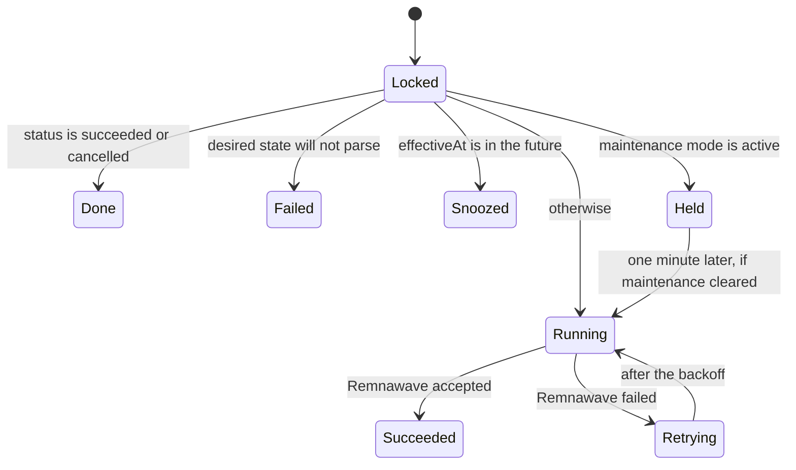

Omniflow moves work off the request path in two different ways, and the difference matters when something is stuck.

Work that is **about one record** and must survive a restart goes on a durable queue: River, running against the same PostgreSQL database, with the job row inserted in the same transaction as the state change that requires it. Work that is **a whole-table pass** — expiring orders, sweeping carts, refreshing blocklists, deleting yesterday's sessions — runs on plain in-process tickers, because a durable queue would add a row and a retry policy to something a ticker already expresses safely.

Only the `worker` process executes jobs. The API creates a River client for *inserting* and never registers a worker; the bot creates orders and payment intents but does not enqueue fulfillment at all.

## The durable queue

Three queues exist, with fixed concurrency compiled in:

| Queue | Max workers | Carries |
| --- | --- | --- |
| `critical` | 16 | Both job kinds — a customer has already paid by the time either runs |
| `default` | 32 | Nothing today |
| `bulk` | 8 | Nothing today |

### The two job kinds

| Kind | Arguments | Queue | Max attempts | Uniqueness |
| --- | --- | --- | --- | --- |
| `fulfillment` | `{"operationId": …}` | `critical` | 12 | Unique by arguments |
| `goods_delivery` | `{"orderId": …}` | `critical` | 12 | Unique by arguments |

Uniqueness by arguments is what makes a duplicated enqueue — from a replayed webhook, a retried settlement, or an operator clicking twice — collapse into the existing job rather than racing it.

### Why the job is inserted in the paying transaction

The rule the code follows is that a durable job is enqueued in the same PostgreSQL transaction as the state change that requires it. Settling an order and inserting its fulfillment job commit together, which is what makes "a paid order always has a job waiting for it" true. The alternative — settle, commit, then enqueue — has a window in which the process can die between the two, leaving a customer who has paid and a queue that has never heard of them.

The same property makes retries safe. A fulfillment operation carries a unique `idempotency_key`, so River's at-least-once delivery cannot double-apply it, and a retry from the panel re-queues under that same key rather than creating a second operation.

### The queue schema is not created by any migration

River keeps its own tables (`river_job`, `river_leader`, `river_client`, `river_queue`, `river_migration`). Nothing in `database/migrations/` creates them, no Go file imports River's `rivermigrate` package, and the compose `migrate` service applies Omniflow's Atlas migrations only.

On a database where those tables do not exist, the worker's `client.Start` fails and the process exits with a non-zero status after logging `start River`. The API's job inserts fail with it, which surfaces as a checkout that cannot complete.

<Warning>
  This is the current state of the repository, not a configuration you have missed. Until a River migration ships, treat the queue schema as a prerequisite you must satisfy outside the documented deployment path, and expect the worker to exit on start until it exists.
</Warning>

## Fulfillment jobs

A `fulfillment` job applies one desired entitlement state to Remnawave. It is the only path by which Omniflow writes to the panel, which is why every retry, hold and refusal below is written to a record an operator can read afterwards. The commerce side of it is described in [Fulfillment](/commerce/fulfillment).

The worker opens a serializable transaction, locks the operation row, and then:

- **Unparseable desired state** marks the operation `failed` with the code `invalid_desired_state`, notifies operators, and cancels the job. Retrying it would fail identically twelve times.
- **A future `effectiveAt`** snoozes the job until that moment instead of burning attempts on a scheduled change that is not due.
- **Maintenance mode** parks the operation as `retrying` with `last_error_code = maintenance_active` and snoozes for one minute. The attempt count is decremented back first, so a hold costs no retry budget however long the window lasts. See [Maintenance mode](/operations/maintenance-mode).
- **A provider failure** stores a classified error code and a `next_attempt_at` computed as `5s × 2^attempt`, capped at the eighth attempt — so the backoff runs 10s, 20s, 40s … up to 1280 seconds between tries.

Supported operations are `create`, `reconcile`, `extend`, `set_limits`, `set_squads`, `enable`, `disable` and `reset_traffic`. Anything else cancels the job rather than retrying it.

After **three** failed attempts — and immediately on a permanent failure — the worker queues an operator notice on the `fulfillment_failure` topic, deduplicated on `operation:<id>` so one struggling entitlement produces one message however many times it retries. The notice carries the entitlement ID, the operation, the classified error code and the status — never a Remnawave response body. See [Operator notifications](/operations/operator-notifications).

A `reconcile` operation also compares the local desired state with what Remnawave reports and records any mismatch as an entitlement drift (`missing_remote`, `expiry`, `traffic`, `device_limit`, `squads`, `status`). A successful apply resolves the open drifts for that entitlement.

## Digital-goods delivery jobs

A `goods_delivery` job hands one paid shop order to its provider. The guarantee it has to keep is that a paid order is submitted **at most once**, and the shape of the worker is that guarantee:

1. A short transaction locks the delivery row, refuses anything already resolved, and claims the next attempt — incrementing the counter and pushing the retry deadline out *before* the provider is called. That transaction commits.
2. The provider call happens outside any transaction. A worker that dies here leaves a row already marked submitted with its deadline moved, so nothing picks it up immediately and re-buys.
3. A second transaction records the outcome.

The `goods_deliveries` row, not the queue, is the source of truth about what is owed. River's twelve attempts cover failures that never reached the provider — a brief database outage, a lost connection — while the row's own attempt count governs how many times the provider is actually asked. The larger River budget therefore cannot turn into extra purchases. An adapter that returns an error rather than a classified outcome is treated as an ambiguous failure with the code `adapter_error`, because "we do not know whether the purchase happened" is not the same as "it did not".

This worker exists only when `APP_DATA_ENCRYPTION_KEY` is set on the worker, since a provider credential cannot be unsealed without it. Without the key the worker logs `digital goods delivery disabled` and runs everything else.

<Note>
  Digital-goods delivery is uninstrumented: it opens no trace span and records no job metric, so `omniflow_jobs_total{kind="goods_delivery"}` never appears. Watch it through the panel's shop views rather than through Prometheus. See [Health, metrics, and logs](/operations/observability#what-is-declared-but-never-written).
</Note>

## The dead-letter queue, retries and cancellation

There are two operator surfaces and they show different things. Reach for the right one.

### River rows, over the bearer token

`GET /v1/admin/jobs` lists actual queue rows and is the only place a job that never produced a fulfillment operation is visible.

| Parameter | Values |
| --- | --- |
| `state` | `dead_letter` (the default; discarded plus cancelled), `retryable`, `running`, `available`, `scheduled`, `completed`. Anything else answers `400 invalid_state` |
| `limit` | 1–200, default 50 |

Each row returns the ID, kind, queue, state, attempt and max attempts, created and attempted timestamps, the error count, and the **last error passed through the redactor**. Job arguments are summarised rather than echoed, because they carry identifiers that belong behind the records they point at.

- `POST /v1/admin/jobs/{jobID}/retry` moves a job back to available.
- `POST /v1/admin/jobs/{jobID}/cancel` cancels it.

Either answers `422 job_mutation_rejected` when the job's current state forbids the change, and both answer `503 jobs_unavailable` in a process that has no job client. All three routes are authenticated with `APP_OPERATOR_TOKEN`; see [Admin API](/integrations/api).

### Fulfillment operations, in the panel

`/admin/system` → **Jobs** (permission `system.read`) is hard-filtered to failed fulfillment operations, which is the dead-letter view an operator actually needs: created-at, operation, attempt count, error code and correlation ID. It never shows a provider payload or a Remnawave response body — a status, a classification and a correlation identifier is what you need to decide whether to retry, and none of it can leak a subscription link onto an operator's screen.

With `system.write`:

- **Retry** re-queues the same operation under the **same idempotency key**, so the worker still performs it exactly once.
- **Cancel** abandons an operation that has not succeeded.

A **succeeded** operation is neither retryable nor cancellable, and the refusal is a `409 state_conflict` enforced in SQL rather than checked in Go. Retracting a completed provisioning by panel click would leave the entitlement and Remnawave disagreeing with no record of why.

Every panel mutation requires an `X-Operator-Reason` header and writes an audit event — `panel.fulfillment.retried` or `panel.fulfillment.cancelled`, category `system`. The attempt history behind an operation is available at `GET /v1/panel/system/jobs/{operationID}/history` with the status, correlation ID, error code and time of each attempt; the stored request and response summaries are deliberately never returned.

| Route | Permission |
| --- | --- |
| `GET /v1/panel/system/jobs` | `system.read` |
| `GET /v1/panel/system/jobs/{operationID}/history` | `system.read` |
| `POST /v1/panel/system/jobs/{operationID}/retry` | `system.write` |
| `POST /v1/panel/system/jobs/{operationID}/cancel` | `system.write` |

## Scheduled loops that are not queue jobs

These are goroutines started by the three `main`s. Each pass is a whole-table sweep that is safe to repeat and carries no per-record argument, and each is independent: a failing pass is logged and never stops the others.

| Loop | Process | Interval | Configurable | What it does |
| --- | --- | --- | --- | --- |
| Commerce maintenance | api | 1 min | no | Expires pending orders, expires wallet credits as a double-entry `expiration` transaction, sweeps saved carts |
| Payment reconciler | api | 1 min | no | Re-polls up to 100 in-flight payment intents |
| Maintenance controller | api | `APP_MAINTENANCE_PROBE_SECONDS` (30s) | yes | Samples dependency health and moves the maintenance switch |
| Telemetry heartbeat | api | 24 h, plus one at start | on/off only | Sends `installation.heartbeat` |
| Collector retention | api (collector mode) | 24 h | no | Deletes collected telemetry older than 180 days |
| Fulfillment scheduler | worker | 15 min | no | Creates `reconcile` operations for up to 500 entitlements, keyed `reconcile:<entitlementID>:<15-minute bucket>` |
| Goods-delivery scheduler | worker | 30 s | no | Enqueues up to 200 due deliveries |
| Renewal and dunning | worker | 1 min | no | Charges due renewals in batches of 100 |
| Lifecycle sweeper | worker | 5 min (anomalies 15 min) | no | Expires gifts and personal offers, refreshes up to 20 blocklist sources, evaluates anomaly rules |
| Campaign expansion | worker | 1 min | no | Expands campaign audiences, batch 5 000 |
| Bulk-action runner | worker | 15 s | no | Applies previewed bulk operations one item at a time, batch 50 |
| Retention sweep | worker | `APP_RETENTION_INTERVAL_HOURS` (1 h) | yes | Seven cleanup steps, below |
| Scheduled backup | worker | `APP_BACKUP_INTERVAL_HOURS` (24 h) | yes | Encrypted `pg_dump` plus prune |
| Channel membership | bot | 10 min | no | Re-verifies required-channel membership, batch 100 |
| Operator notifier | bot | 10 s | no | Binds forum topics, then drains up to 50 pending notices |

The fulfillment scheduler's bucketed idempotency key is worth understanding: two passes inside the same fifteen-minute bucket produce the same key, so a restarted worker cannot create a second reconcile operation for the same entitlement in the same window.

Two loops are disabled when the worker has no `APP_DATA_ENCRYPTION_KEY`, because both read sealed credentials: the lifecycle sweeper's blocklist refresh and anomaly evaluation, and the bulk-action runner. Gift and offer expiry still run. The channel-membership loop is disabled when no membership verifier is configured.

<Warning>
  None of these loops takes a lease or an advisory lock. River elects a leader for the queues, but a second `api`, `bot` or `worker` container runs a second copy of every loop above. They are individually idempotent, so duplication wastes work rather than corrupting state — but the supported topology is one instance per role. See [Deployment](/operations/deployment#supported-topology).
</Warning>

## Retention sweeps

The hourly retention pass deletes disposable operational data. It never touches financial, audit, consent, identity or entitlement history, which is append-only for the life of the installation. Seven independent steps run in order, and one failing step is logged and skipped so a single locked table cannot stall retention.

| Step | Deletes | Window |
| --- | --- | --- |
| `bot_sessions` | Expired bot sessions | row-level `expires_at` |
| `bot_checkout_sessions` | Expired checkout sessions that never became an order | row-level `expires_at` |
| `provider_webhook_events` | Webhook intake rows past their retention stamp | row-level `retain_until` |
| `support_attachments` | Expired attachment rows, plus the files behind them | row-level |
| `outbox_events` | Published events | `APP_RETENTION_OUTBOX_DAYS` (7) |
| `telemetry_events` | Collected telemetry by `received_at` | `APP_RETENTION_TELEMETRY_DAYS` (30) |
| `entitlement_drifts` | Drifts whose status is not `open`, by `resolved_at` | `APP_RETENTION_DRIFT_DAYS` (90) |

A step that removed rows logs `retention sweep removed rows` with the table and the count.

The attachment step is the one with a twist. Attachment files are named by their content digest, so one file can back several rows, and only the code deleting the rows can tell which files nothing references any more. The sweeper reads the candidate keys *inside* the deleting transaction, deletes the expired rows, then removes only files no surviving row still references. A file it cannot remove is logged and skipped rather than failing the sweep. Without an attachment sweeper attached — a Telegram-only installation — the worker still deletes the rows, because those attachments are references to bytes Telegram holds.

<Warning>
  If the worker's `APP_SUPPORT_ATTACHMENT_DIR` differs from the API's, retention deletes the rows and leaves the bytes on disk forever. Set it to the same shared path on both, and give it a volume — see [Deployment](/operations/deployment#what-must-persist).
</Warning>

Only the worker runs retention. An installation running just `api` and `bot` never cleans up any of the above.

## The transactional outbox

Three domain events are written to `outbox_events` in the same transaction as the change they describe, so a committed state change always has its event and a rolled-back one never does:

| Topic | Written when |
| --- | --- |
| `order.paid` | An order settles and its entitlement is created |
| `wallet.credited` | A wallet top-up settles |
| `addon.purchased` | An add-on order settles onto an entitlement |

Two surfaces read the backlog. `GET /v1/admin/outbox` returns `{pendingCount, oldestAgeSeconds}`; the panel's **System → Outbox** tab (permission `system.read`) lists the topic and age of each pending event and nothing else, because an outbox payload is a domain event that can name a customer and an amount, and "is the publisher running" needs neither.

<Warning>
  **Nothing dispatches the outbox.** No code in Omniflow ever sets `outbox_events.published_at`, and there is no publisher process, no subscriber, and no delivery target. Two consequences follow directly. The pending count grows for the life of the installation and never falls, so a rising number here is the normal steady state rather than an incident. And because the retention step deletes only rows where `published_at` is not null, `APP_RETENTION_OUTBOX_DAYS` removes nothing at all — the table grows without bound alongside the count.
</Warning>

`omniflow_outbox_pending_events` is declared but never set, so the gauge is not an alternative view of this. Read the count from the admin route or the panel tab if you want to track the table's size.

## Related

<CardGroup cols={2}>
  <Card title="Fulfillment" icon="arrows-rotate" href="/commerce/fulfillment">
    What a fulfillment operation is, and how drift recovery works.
  </Card>
  <Card title="Health, metrics, and logs" icon="heart-pulse" href="/operations/observability">
    Which of these jobs produce a metric, and which do not.
  </Card>
  <Card title="Maintenance mode" icon="wrench" href="/operations/maintenance-mode">
    Why a fulfillment job may be snoozed rather than failing.
  </Card>
  <Card title="Admin operations" icon="sliders" href="/operations/admin-operations">
    The rest of the System screens: webhooks, drift, and diagnostics.
  </Card>
</CardGroup>
