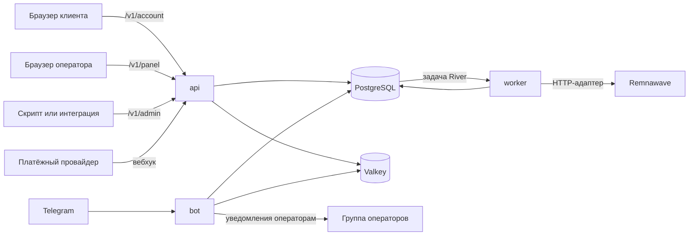

Omniflow — это один модуль Go с тремя точками входа (`cmd/api`, `cmd/bot`, `cmd/worker`), собираемыми из
одного дерева исходников в три образа, плюс одно приложение Next.js, несущее оба браузерных интерфейса. Они
используют одну базу данных PostgreSQL и один экземпляр Valkey. PostgreSQL — единственный надёжный источник
истины; Valkey хранит кеш, счётчики ограничения частоты запросов, блокировки и временное состояние, а стек
compose запускает его с `--save "" --appendonly no`, чтобы ни у кого не возникло соблазна считать его
хранилищем.

Разделение на три процесса сделано ради изоляции отказов и различий во времени жизни, а не ради
масштабирования. Пакет из четырёхсот изменений подписок не должен быть привязан ко времени жизни HTTP-запроса,
который его начал, а автоматические продления — единственное место, где деньги движутся без наблюдателя, —
выполняются там, где ни один запрос не может их отменить.

## Четыре процесса

| Процесс | Точка входа | Слушает | Отвечает за |
| --- | --- | --- | --- |
| `api` | `cmd/api` | `APP_HTTP_ADDR`, по умолчанию `:8080` | HTTP API (`/v1/catalog`, `/v1/payments/webhooks/{provider}`, `/v1/admin`, `/v1/panel`, `/v1/account`), пробы и `/metrics`, автоопределение режима обслуживания, сверку платежей, цикл обслуживания заказов, кошельков и корзин, анонимный телеметрический сигнал и токен первичной настройки администратора |
| `bot` | `cmd/bot` | По умолчанию long polling; `APP_BOT_HTTP_ADDR`, по умолчанию `:8082`, в режиме вебхука; пробы и `/metrics` — только если задан `APP_BOT_METRICS_ADDR` | Обновления Telegram, отправку уведомлений операторам, повторную проверку обязательной подписки на канал, доставку уведомлений клиентам и интерфейс резервного копирования и восстановления `/ops` |
| `worker` | `cmd/worker` | `APP_WORKER_HTTP_ADDR`, по умолчанию `:8081` | Воркеры задач River (исполнение заказов, доставка цифровых товаров), планировщики сверки и доставки, цикл продлений и напоминаний о неоплате, обходчик жизненного цикла, раскрытие кампаний, исполнитель массовых операций, проходы очистки по срокам хранения и запланированные зашифрованные резервные копии |
| `web` | `apps/web` | `3000` | Одно приложение Next.js, отдающее клиентскую панель на `/account` и рабочее место оператора на `/admin` поверх одной общей системы компонентов shadcn |

Три образа Go различаются только тем, что им нужно во время выполнения: `api` поставляется на distroless-базе,
а `bot` и `worker` — на Alpine с `postgresql18-client`, потому что оба вызывают `pg_dump` и `pg_restore`.
Веб-образ отдаёт standalone-сборку Next.js на базе Node. См.
[Развёртывание](/ru/operations/deployment).

### Без чего каждый процесс отказывается стартовать

Конфигурация читается из переменных окружения один раз, при старте, и неверное значение приводит к фатальной
ошибке, а не остаётся скрытой проблемой. Ничто не перечитывает окружение, поэтому любое изменение — это
перезапуск.

- **`api`** запускается с пустым `APP_DATABASE_URL` и тогда обслуживает только `/healthz`, `/livez`, `/readyz`
  и `/metrics`. Если URL базы данных задан, дополнительно требуются `APP_OPERATOR_TOKEN`, 32-байтный
  `APP_DATA_ENCRYPTION_KEY`, `APP_REMNAWAVE_URL`, `APP_REMNAWAVE_TOKEN` и `APP_VALKEY_URL`, иначе процесс
  завершается с сообщением
  `commerce requires APP_OPERATOR_TOKEN, APP_DATA_ENCRYPTION_KEY, APP_REMNAWAVE_URL, APP_REMNAWAVE_TOKEN, and APP_VALKEY_URL`.
- **`bot`** с пустым `APP_TELEGRAM_TOKEN` пишет в журнал `telegram bot disabled because APP_TELEGRAM_TOKEN is empty`
  и простаивает, пока не получит сигнал, — это поддерживаемая конфигурация, а не ошибка. С токеном он
  требует `APP_DATABASE_URL`, `APP_VALKEY_URL`, `APP_REMNAWAVE_URL` и `APP_REMNAWAVE_TOKEN`. Valkey здесь
  обязателен, потому что ограничение частоты запросов и защита от повтора callback-ов прикрывают нажатия,
  которые двигают деньги.
- **`worker`** требует `APP_DATABASE_URL`, `APP_REMNAWAVE_URL` и `APP_REMNAWAVE_TOKEN`.
  `APP_DATA_ENCRYPTION_KEY` необязателен: без него воркер пишет `digital goods delivery disabled` и
  выполняет всё остальное.

Полный список — в разделе [Конфигурация](/ru/getting-started/configuration).

## Как проходит запрос

Каждая точка входа сначала попадает в PostgreSQL. Только воркер обращается к Remnawave на пути записи, и делает
это из надёжной задачи, а не из запроса.

Покупка делает эту схему конкретной:

<Steps>
  <Step title="Клиент выбирает тариф">
    В браузере это `/account` и маршруты `/v1/account/checkout`; в Telegram — экраны каталога у бота. И то и
    другое создаёт обычную строку заказа.
  </Step>
  <Step title="Создаётся платёжное намерение">
    Заказ получает намерение против одного адаптера провайдера. Клиента отправляют к провайдеру, либо он
    платит в Telegram, либо заказ закрывается за счёт баланса кошелька.
  </Step>
  <Step title="Провайдер присылает обратный вызов">
    `POST /v1/payments/webhooks/{provider}` по необходимости не аутентифицирован и защищён проверкой подписи
    по тем самым байтам, которые прислал провайдер. Повторное событие провайдера разрешается в
    `{"status":"duplicate"}`, а не проводится вторично.
  </Step>
  <Step title="Расчёт, право на услугу и задача коммитятся вместе">
    В одной транзакции API помечает заказ оплаченным, записывает право на услугу, создаёт строку
    `fulfillment_operations` с ключом идемпотентности `order:<orderID>:fulfill`, пишет событие `order.paid` в
    outbox, начисляет реферальное вознаграждение, если оно есть, и вставляет задачу River.
  </Step>
  <Step title="Воркер выдаёт доступ">
    Воркер `fulfillment` забирает задачу, открывает сериализуемую транзакцию, блокирует строку операции и
    вызывает Remnawave. При успехе предыдущие права на услугу этой подписки замещаются, а заказ переходит в
    `fulfilled`.
  </Step>
  <Step title="Клиент видит доступ">
    Ссылка доступа читается из Remnawave вживую на каждый запрос. В Omniflow она никогда не сохраняется.
  </Step>
</Steps>

Если обратный вызов провайдера закоммитился, а вызов Remnawave затем упал, деньги записаны, право на услугу
существует, и есть задача с невыполненной работой. Именно ради этого отказа и проведена граница транзакции.
[Исполнение заказов](/ru/commerce/fulfillment) описывает поведение при повторах, отложенных попытках и
расхождениях.

## Три префикса API — три модели доверия

HTTP API разделён на три префикса, которые никогда не используют общий маршрутизатор.

| Префикс | Учётные данные | Дополнительные проверки | Когда монтируется |
| --- | --- | --- | --- |
| `/v1/panel` | Cookie сессии `__Host-omniflow_admin` (`omniflow_admin` без TLS) | `X-CSRF-Token` на небезопасных методах, право доступа RBAC, объявленное при монтировании каждого маршрута, состояние TOTP-проверки, `X-Operator-Reason` на тех мутациях, где он обязателен | `APP_ADMIN_PANEL_ENABLED=true` и подключён административный сервис |
| `/v1/admin` | `Authorization: Bearer <APP_OPERATOR_TOKEN>` | Нет: ни CSRF, ни RBAC, ни аудита авторизации | Всегда, как только собран коммерческий рантайм |
| `/v1/account` | Cookie сессии `__Host-omniflow_account` (`omniflow_account` без TLS) | `X-CSRF-Token` на небезопасных методах, повторная аутентификация (step-up) на необратимых действиях | `APP_CUSTOMER_PANEL_ENABLED=true` |

Объединение любых двух означало бы, что один молча наследует middleware другого, а учётные данные клиента
никогда не должны иметь возможность дотянуться до операторского маршрута. Структурное разделение делает это
свойством таблицы маршрутов, а не проверкой, о которой кто-то должен помнить; тест утверждает, что клиентский
маршрутизатор отвечает `404` на `/v1/panel/auth/session`, `/v1/admin/orders` и `/v1/panel/admins`.

Префикс, чей сервис не подключён, **отсутствует** — `404`, а не `503`, — потому что `503` сообщил бы анонимному
вызывающему, что настроил оператор. Исключение — маршруты до входа в систему, которые отвечают
`503 panel_unavailable` или `503 account_unavailable`, поскольку они работают до того, как появятся какие-либо
учётные данные.

Общий для процесса middleware применяется ко всем трём: идентификатор запроса, восстановление после паники,
60-секундный таймаут обработчика, OpenTelemetry и метрики. `/v1/admin` — это внешний интерфейс автоматизации:
ничто в этом репозитории его не вызывает, а бот общается с PostgreSQL и Remnawave внутри процесса, а не по
HTTP. См. [Интеграция с API](/ru/integrations/api).

Граница веб-маршрутов организационная, а не защитная. Авторизация проверяется в Go API на каждом запросе, а
серверные компоненты `/admin` проверяют те же права доступа перед отрисовкой; отдельное имя хоста или скрытая
навигация никогда не являются достаточной авторизацией. Каталог прав доступа и сопоставление ролей
вкомпилированы в `internal/rbac`, поэтому панель отрисовывается ровно из того набора, который применяет API, и
правка в базе данных не может расширить доступ.

## Изменение состояния и его надёжная задача коммитятся вместе

Правило в `AGENTS.md` короткое: *ставить надёжные задачи River в очередь в той же транзакции PostgreSQL, что и
изменение состояния, которое их требует*. Именно это делает утверждение «у оплаченного заказа всегда есть
ожидающая его задача» истинным, а не желаемым, и существует интеграционный тест, весь смысл которого — это
свойство.

Хук постановки в очередь — это функция, передаваемая в коммерческое хранилище при старте процесса, поэтому один
и тот же код расчёта транзакционен и в API, и в воркере. Бот намеренно не передаёт хук: он создаёт заказы и
платёжные намерения, но выдача доступа принадлежит воркеру, а расчёт коммитит тот процесс, который получил
обратный вызов.

Повтор безопасен, потому что идентичность несёт надёжная запись, а не очередь. У `fulfillment_operations` есть
`UNIQUE` ключ идемпотентности, а создание строки выполняется как `ON CONFLICT (idempotency_key) DO UPDATE …
RETURNING`, поэтому повтор считывает уже существующую операцию. Повторное использование ключа с другими
параметрами отвергается сразу: *idempotency key was already used with different fulfillment parameters*.
Известные формы ключей: `order:<orderID>:fulfill`, `order:<orderID>:addon`, `gift:<giftID>:fulfill`,
`reconcile:<entitlementID>:<15-minute bucket>`, `panel:<subscriptionID>:<operation>:<requestID>` и
`bulk:<operationID>:<position>`.

Видов задач ровно два — `fulfillment` и `goods_delivery`, — обе на очереди `critical` с `MaxAttempts: 12` и
уникальностью по аргументам задачи. Настроенных очередей три: `critical` (16 воркеров), `default` (32) и `bulk`
(8). Оба воркера зарегистрированы только в процессе worker; API создаёт клиент River для вставки.

<Note>
  Собственные таблицы River — `river_job`, `river_leader`, `river_client`, `river_queue`, `river_migration` —
  не создаются ничем в этом репозитории. Ни одна закоммиченная миграция в `database/migrations/` их не
  определяет, ни один файл Go не импортирует `rivermigrate`, а сервис `migrate` в compose прогоняет Atlas
  только по собственной схеме Omniflow. Создание схемы очередей сейчас не входит в описанное развёртывание.
</Note>

## Транзакционный outbox

Три топика записываются в `outbox_events` внутри той транзакции, которая их вызвала: `order.paid`,
`wallet.credited` и `addon.purchased`. Строка несёт топик и полезную нагрузку и записывается с той же гарантией
«всё или ничего», что и стоящее рядом изменение состояния.

Ничто их не рассылает. Ни один путь кода не выставляет `outbox_events.published_at`; единственные операторы,
которые трогают этот столбец, — два чтения с `WHERE published_at IS NULL` и удаление по сроку хранения, которое
отбирает `published_at IS NOT NULL`. На практике это означает, что outbox — надёжная запись о случившемся, а не
механизм доставки: `GET /v1/admin/outbox` сообщает `pendingCount`, который только растёт,
`APP_RETENTION_OUTBOX_DAYS` ничего не удаляет, а вкладка outbox в панели по адресу
`GET /v1/panel/system/outbox` показывает только топик и возраст — никогда полезную нагрузку, в которой могут
быть имя клиента и сумма.

## Циклы, которые намеренно не являются задачами

Четырнадцать циклов на таймерах работают как горутины внутри трёх процессов: обслуживание заказов и корзин,
сверка платежей, проверка режима обслуживания, телеметрический сигнал, планирование сверки и доставки,
продления, обходчик жизненного цикла, раскрытие кампаний, исполнитель массовых операций, очистка по срокам
хранения, резервные копии, членство в каналах и разбор очереди уведомлений операторам.

Они не являются задачами River, потому что каждый из них — полный проход по таблице, который безопасно
повторять и который не несёт аргумента для отдельной записи, так что надёжная очередь добавила бы строку и
политику повторов к тому, что уже выражает таймер. Повторяются два свойства: неудачный проход никогда не
останавливает остальные, и каждый проход идемпотентен, поэтому дважды выполненная зачистка приводит к тому же
состоянию, что и однократная. Настраиваются только интервалы обслуживания, очистки по срокам хранения и
резервного копирования; остальные вкомпилированы. Полный перечень — в разделе
[Задачи и очереди](/ru/operations/jobs-and-queues).

## Поддерживаемая топология

Запускайте по одному экземпляру каждого процесса. River координирует собственные очереди через выборы лидера,
но каждый перечисленный выше цикл — это обычный внутрипроцессный таймер без advisory-блокировки и без аренды.
Два воркера означают по два экземпляра каждой зачистки, два API — два контроллера режима обслуживания и две
сверки платежей, а два бота — два разбора очереди уведомлений.

Стек compose не объявляет политику `restart:` ни для `postgres`, ни для `valkey`, `api`, `bot`, `worker` или
`web`; её задаёт только оверлей Traefik. Упавший процесс останется лежать, пока кто-нибудь не заметит, — именно
для этого нужны пробы и [Наблюдаемость](/ru/operations/observability).

## Почему модульный монолит

`AGENTS.md` формулирует правило — *держать приложение на Go модульным монолитом с независимыми точками входа
`api`, `bot` и `worker`*, — и его удерживают четыре вспомогательных ограничения:

- Доменные пакеты не должны импортировать транспорт, генерацию базы данных, Telegram и пакеты конкретных
  провайдеров. Стрелки зависимостей направлены в одну сторону.
- Внешние системы скрыты за небольшими интерфейсами. К Remnawave обращаются только через `remnawave.Service`,
  `remnawave.Provisioner` и `remnawave.Importer`, поэтому все типы, повторяющие форму Remnawave, живут в одном
  пакете.
- Доменные события идут через транзакционный outbox, и брокер сообщений не вводится без принятого
  архитектурного решения.
- Построение зависимостей остаётся явным, без фреймворка внедрения зависимостей до тех пор, пока этого не
  потребует сложность связывания.

Что из этого получает оператор: одну базу данных, один набор миграций, один `.env` и три контейнера для
запуска. Что получает контрибьютор: изменение, затрагивающее оформление заказа, право на услугу и выдачу
доступа, — это одна транзакция и один тест, а не распределённый протокол. Это позволяет поддерживать сотни
независимых установок, не навязывая ни одной из них брокер, Kubernetes или среду выполнения плагинов.

## Куда двигаться дальше

<CardGroup cols={2}>
  <Card title="Владение данными" icon="scale-balanced" href="/ru/architecture/data-ownership">
    Точная граница с Remnawave: за что каждая система авторитетна и что ломается при нарушении границы.
  </Card>
  <Card title="Технологии" icon="layer-group" href="/ru/architecture/technology">
    Каждый компонент стека и причина, по которой он там есть.
  </Card>
  <Card title="Задачи и очереди" icon="list-check" href="/ru/operations/jobs-and-queues">
    Виды задач, повторы, недоставленные задачи, циклы по расписанию и проходы очистки по срокам хранения.
  </Card>
  <Card title="Развёртывание" icon="server" href="/ru/operations/deployment">
    Топология compose, тома, миграции и обновления.
  </Card>
</CardGroup>
