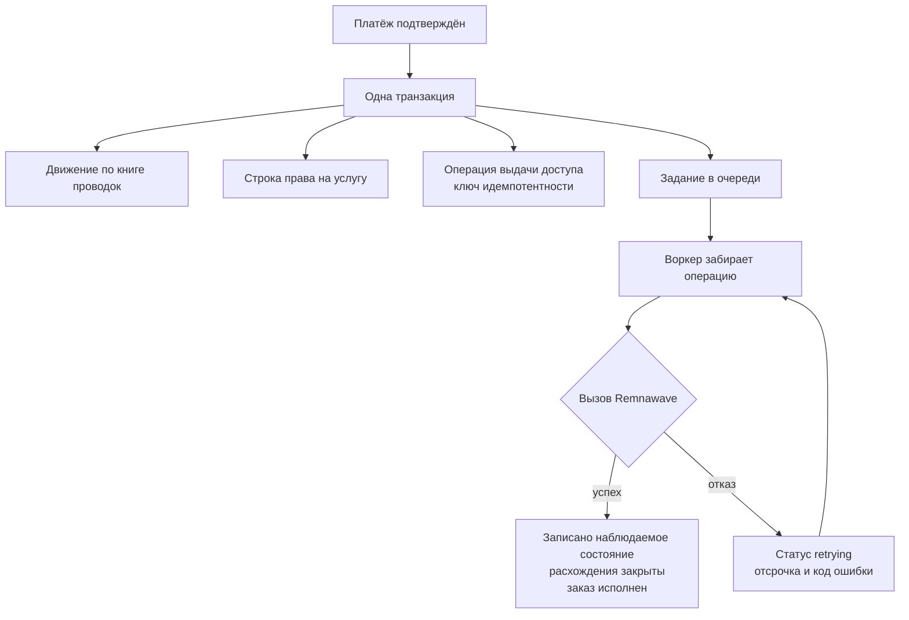

Выдача доступа — та часть Omniflow, которая превращает деньги в доступ. Клиент платит, право на услугу
фиксирует, что именно было куплено, а долговечная операция проталкивает это состояние в Remnawave. Это
намеренно три разные записи: состояние платежа, состояние права на услугу и состояние Remnawave отказывают
независимо друг от друга, и объединение их в одну означало бы, что сбой панели может потерять платёж.

Omniflow никогда не пишет в хранилище Remnawave. Каждое изменение, которое он вносит в VPN-пользователя, —
это HTTP-вызов к поддерживаемому API панели, описанный в
[Интеграция с Remnawave](/ru/integrations/remnawave). Эта страница описывает механику посередине: запись
операции, её ключ идемпотентности, расписание повторов, проход сверки, который чинит расхождения, и путь
разбора отказавших операций, которым пользуется оператор, когда запуск перестал восстанавливаться сам.

## Четыре записи

| Таблица | Что в ней хранится |
| --- | --- |
| `entitlements` | Что Omniflow должен по одному заказу: версия тарифа, период, трафик, лимит устройств, сквады, плюс последнее наблюдавшееся состояние в Remnawave |
| `fulfillment_operations` | Одна долговечная идемпотентная инструкция протолкнуть это состояние в Remnawave |
| `fulfillment_history` | Одна строка на попытку с безопасной сводкой и классифицированным кодом ошибки |
| `entitlement_drifts` | Одно наблюдаемое расхождение между тем, чего хочет Omniflow, и тем, что содержит Remnawave |

Право на услугу имеет `UNIQUE (order_id)`, поэтому один заказ никогда не может породить два таких права, а
`CHECK (ends_at > starts_at)` делает нулевой или отрицательный период непредставимым. Его статус — одно из
`pending`, `active`, `limited`, `disabled`, `expired`, `superseded` или `failed`. Локально записываются только
`pending` и `superseded`: `pending` — это промежуток между расчётом и первым успешным проталкиванием,
`superseded` проставляется предыдущему праву на услугу той же подписки, как только выдано заменяющее. Каждое
остальное значение читается обратно из Remnawave — `ACTIVE` становится `active`, `LIMITED` становится
`limited`, `DISABLED` становится `disabled`, `EXPIRED` становится `expired`, а нераспознанный Omniflow статус
становится `failed`, а не угадывается.

<Note>
  Право на услугу никогда не становится `expired` по таймеру. Фаза, которую видит клиент, вычисляется из
  `ends_at` в момент чтения; хранимый статус меняется только тогда, когда проход сверки прочитает `EXPIRED`
  обратно из панели. См. [Подписки](/ru/commerce/subscriptions) про лестницу фаз.
</Note>

## От оплаченного заказа к работающему доступу

Право на услугу никто не создаёт руками. Оно пишется путём расчёта внутри той же транзакции, которая помечает
заказ оплаченным, и задание выдачи доступа вставляется в этой же транзакции.

Транзакционная вставка задания и есть весь смысл: движение по книге проводок, право на услугу, уведомление
оператору и долговечное намерение выдать доступ либо коммитятся все вместе, либо ни одно. Существует
интеграционный тест, единственная задача которого — утверждать это свойство, потому что «мы вставляем задание
сразу после коммита» — это соглашение о порядке, которое ломает падение процесса, а инвариант оно сломать не
может.

При успехе воркер записывает наблюдаемое состояние Remnawave в право на услугу и в подписку, закрывает все
открытые расхождения по этому праву и — для `create` — помечает предыдущие права на услугу той же подписки как
`superseded` и переводит заказ в `fulfilled`. Поэтому вторая подписка клиента никогда не выводит из
обращения право на услугу первой.

## Набор операций

Существует восемь операций, и это обеспечивается как `CHECK` в базе данных, так и белым списком в сервисе,
который их ставит в очередь.

| Операция | Что вызывает воркер |
| --- | --- |
| `create` (удалённый пользователь неизвестен) | `GET /api/users/by-username/{candidate}` по каждому кандидату; при `404` по всем — `POST /api/users/` |
| `create` (удалённый пользователь известен) | `PATCH /api/users/`; `404` откатывается на путь создания или подхвата |
| `extend`, `set_limits`, `set_squads` | `PATCH /api/users/` |
| `enable` | `POST /api/users/{id}/actions/enable`, затем повторное чтение пользователя |
| `disable` | `POST /api/users/{id}/actions/disable`, затем повторное чтение |
| `reset_traffic` | `POST /api/users/{id}/actions/reset-traffic`, затем повторное чтение |
| `reconcile` | Сначала сравнение, затем тот же путь, что и у `create` |

Всё, что вне этого набора, окончательно отменяется, а не повторяется, потому что операция, которую воркер не
умеет выполнять, от ожидания выполнимой не станет.

### Детерминированное имя пользователя и подхват удалённого пользователя

Пользователь Remnawave для подписки называется `omniflow_` плюс первые шестнадцать шестнадцатеричных символов
UUID подписки. Установки, обновлённые с v0.4, дополнительно принимают устаревшее имя, производное от UUID
*клиента*, для слота 1.

Это предотвращает два разных отказа. Повторённый после потерянного ответа `create` не должен породить второго
пользователя Remnawave, поэтому воркер сначала ищет имя пользователя и только потом создаёт его. А установка,
где пользователи Remnawave уже были, должна их подхватить, а не продублировать, — именно поэтому слот 1
пробует обоих кандидатов. Вывод имени из подписки, а не из клиента, — это ровно то, что позволяет одному
клиенту владеть несколькими независимыми пользователями Remnawave.

Подписка в слоте 2 и выше без сохранённого сопоставления возвращает *отсутствие* удалённого пользователя, а не
откатывается на пользователя уровня клиента, так что вторую подписку никогда нельзя спутать с удалённым
состоянием первой. Операция, отличная от `create`, в этой позиции завершается с `remote_user_not_found` и
повторяется: нельзя выполнить `enable` для того, чему доступ никогда не выдавался.

## Идемпотентность

Каждая операция несёт ключ идемпотентности с ограничением `UNIQUE` в таблице. Вставка дублирующего ключа
читает существующую операцию обратно, а не создаёт вторую.

| Ключ | Кем пишется |
| --- | --- |
| `order:<orderID>:fulfill` | Рассчитанная покупка, продление, повышение или понижение тарифа |
| `order:<orderID>:addon` | Дополнение в середине периода, свёрнутое в один `set_limits` |
| `gift:<giftID>:fulfill` | Активированный подарок |
| `reconcile:<entitlementID>:<15-minute bucket>` | Проход сверки |
| `panel:<subscriptionID>:<operation>:<requestID>` | Действие оператора в панели |
| `bulk:<operationID>:<position>` | Один элемент массовой операции |

Одного лишь чтения строки обратно недостаточно, поэтому сервис затем перепроверяет параметры. Переиспользование
ключа с другим правом на услугу, другой операцией, другим моментом вступления в силу, моментом окончания,
объёмом трафика, лимитом устройств или набором сквадов отклоняется с сообщением *«idempotency key was already
used with different fulfillment parameters»*. Ключ — это обещание, что инструкция та же самая, и молчаливое
применение другой инструкции под старым ключом — ровно тот отказ, ради предотвращения которого это обещание и
существует.

Ещё два отказа происходят до того, как что-либо ставится в очередь:

- `extend` требует `endsAt` строго позже текущего окончания права на услугу. Продление на более ранний момент
  сократило бы то, что клиент купил.
- Отрицательный объём трафика или лимит устройств отклоняется сразу.

## Повторы, отсрочка и окончательный отказ

Задание выполняется в транзакции уровня `Serializable` и берёт `SELECT … FOR UPDATE` на строку операции, так
что два воркера не могут применить одну операцию одновременно. Операция, уже находящаяся в статусе `succeeded`
или `cancelled`, коммитится и ничего не делает.

Каждый отказ записывает операцию обратно в `retrying` с классифицированным кодом ошибки и зафиксированным
временем следующей попытки `5s × 2^min(attempt, 8)` — пять секунд, затем десять, двадцать и так далее до
потолка в 1280 секунд. Очередь даёт заданию двенадцать попыток, после чего оно перестаёт повторяться само.
Строка операции при этом сохраняет статус `retrying` и последний код ошибки, что важно, когда вы её ищете, —
см. [путь разбора отказавших операций](#путь-разбора-отказавших-операций).

| Код ошибки | Значение |
| --- | --- |
| `remote_user_not_found` | Remnawave вернул `404` для пользователя, названного в этой операции |
| `remnawave_http_<status>` | Панель ответила этим статусом |
| `remnawave_unavailable` | Вызов не завершился — таймаут, отказ соединения, нечитаемый ответ |
| `invalid_desired_state` | Сохранённое желаемое состояние не удалось декодировать |
| `maintenance_active` | Выдача доступа удержана, а не провалена |

Ошибки классифицируются, а не хранятся свободным текстом, поэтому список отказавших операций читается с одного
взгляда, а оператору никогда не отдаётся тело ответа провайдера.

Два исхода повторами не являются:

- Некорректное `desired_state` приводит к **окончательному** отказу. Операция переходит в `failed`,
  уведомление оператору ставится в очередь, а задание отменяется. Повтор сообщения, которое воркер не может
  разобрать, дал бы ту же ошибку разбора двенадцать раз подряд.
- `effectiveAt` в будущем **откладывает** задание до этого момента вместо того, чтобы тратить попытку. Именно
  так понижение тарифа `at_expiry` дожидается конца текущего периода, не занимая воркер.

После трёх неудачных попыток уведомление оператору вида `fulfillment_failure` ставится в очередь внутри
собственной транзакции воркера, так что оно существует ровно тогда, когда отказ стал долговечным. Оно
дедуплицируется по `operation:<operationID>`, а значит одно проблемное право на услугу порождает одно
сообщение независимо от числа повторов. Оно несёт идентификатор права на услугу, операцию, классифицированный
код ошибки и статус — но никогда тело ответа Remnawave, ссылку на доступ или клиентский контент. Доставка
описана в [Уведомления оператору](/ru/operations/operator-notifications).

### Когда Remnawave недоступен

Ничего не теряется и ничего не возвращается. Платёж уже записан, право на услугу уже существует, а операция
лежит в `retrying` с `last_error_code = "remnawave_unavailable"` до тех пор, пока панель не ответит. Клиент
видит подписку в фазе `provisioning`, а не ошибку, и клиентская веб-панель помечает свои живые показатели как
`degraded`, а не выдаёт устаревшие числа за текущие.

Затяжной сбой обычно вместо этого включает [режим обслуживания](/ru/operations/maintenance-mode), который
меняет поведение намеренно.

## Режим обслуживания удерживает выдачу доступа

Пока режим обслуживания активен, `Blocks(ActionFulfillment)` истинно, и воркер удерживает операцию вместо того,
чтобы её выполнять. Проверка происходит *после* того, как операция забрана: воркер откатывает счётчик попыток
назад, чтобы пауза не съедала повтор, записывает `maintenance_active`, выставляет статус `retrying` со
следующей попыткой через минуту, коммитится и откладывает задание на минуту.

Удержание выдачи доступа без её потери означает, что сбой стоит задержки, а не права на услугу. Покупки в это
же время заблокированы, поэтому новые деньги не входят в установку, которая не может выдать доступ; уже
принятые деньги не трогаются, а расчёты, возвраты и история заказов продолжают работать.

## Плановая сверка

Каждые пятнадцать минут процесс воркера ставит в очередь операцию `reconcile` для не более чем 500 прав на
услугу, у которых `reconciled_at` пуст или старше пятнадцати минут. Это самовосстанавливающийся цикл: он
обнаруживает расхождение, пересоздаёт удалённого пользователя, которого кто-то удалил, заново проталкивает
желаемое окончание, трафик, лимит устройств и набор сквадов и обновляет `observed_state`, который читают панель
и клиентские поверхности.

- Ключ идемпотентности — `reconcile:<entitlementID>:<bucket>`, где корзина — это текущее время, усечённое до
  пятнадцати минут. Два прохода внутри одной корзины сходятся к одной операции.
- Идентификатор корреляции — `scheduler:<bucket>`, именно так попытка сверки отличается в истории от попытки,
  вызванной покупкой.
- Желаемое состояние пересобирается из самой строки права на услугу и не несёт `effectiveAt`, поэтому сверка
  никогда не откладывается.
- Права на услугу в статусе `pending` **не** выбираются. Они всё ещё ждут своего первого `create`, а проход
  сверки не является его заменой.
- `reconciled_at` проставляется только после успешного применения, поэтому окончательно отказывающее право на
  услугу переставляется в очередь в каждой корзине и порождает одну новую строку операции каждые пятнадцать
  минут.

Интервал и размер пакета зашиты в коде. Переменной окружения нет ни для того, ни для другого.

<Warning>
  Сверка и выдача доступа выполняются только в процессе воркера. Установка, где запущены API и бот без
  `cmd/worker`, принимает платежи и никогда ничего не выдаёт.
</Warning>

## Обнаружение расхождений

`reconcile` сравнивает желаемое состояние права на услугу с тем, что Remnawave содержит на самом деле, и
записывает каждое расхождение строкой в `entitlement_drifts` с JSON-полями `expected` и `observed`.

Remnawave — панель, которую может редактировать человек. Тот, кто вручную продлил пользователя, удалил его или
изменил лимит устройств, порождает систему, которая противоречит сама себе, и клиент обычно замечает это
раньше оператора. Запись расхождения до его исправления даёт оператору объяснение вместо молчаливой перезаписи.

| Вид | Когда обнаруживается |
| --- | --- |
| `missing_remote` | Удалённый пользователь неизвестен либо `GET /api/users/{id}` возвращает `404` |
| `expiry` | Удалённый момент окончания отличается от желаемого окончания |
| `traffic` | Настроенный объём отличается от удалённого лимита трафика |
| `device_limit` | Настроенный лимит отличается от удалённого лимита устройств, включая случай удалённого null |
| `squads` | Удалённый набор активных сквадов отличается от желаемого, сравнение без учёта порядка |
| `status` | Отображённый удалённый статус отличается от сохранённого статуса права на услугу |

Одно открытое расхождение на пару `(entitlement_id, kind)` обеспечивается частичным уникальным индексом;
повторное обнаружение обновляет `expected`, `observed` и `detected_at`, а не накапливает строки. Расхождение
всегда вычисляется относительно того пользователя Remnawave, которым владеет *эта* подписка.

<Note>
  **Пустой список расхождений — это нормально, а не доказательство того, что расхождений никогда не было.** В
  успешном проходе сверки та же транзакция, которая открывает строки расхождений, закрывает их, как только
  исправляющий `PATCH` отработал. Расхождение остаётся открытым только пока исправляющая работа отказывает или
  Remnawave остаётся недоступен. Читайте **/admin → System → Drift** как «что сейчас невозможно починить», а не
  как журнал изменений панели.
</Note>

`external_edit` присутствует в ограничении `CHECK` таблицы и в схеме API, но не пишется ни одним путём кода.
Внешне изменённый пользователь на самом деле порождает конкретное расхождение по полю — `expiry`, `traffic`,
`device_limit`, `squads` или `status`.

Если само сравнение не удаётся по причине, отличной от `404`, — ошибка чтения панели, — пишется строка истории
со статусом `retrying`, и задание повторяется, ничего не применив, так что плохое чтение никогда не становится
плохой записью.

Закрытые строки расхождений старше `APP_RETENTION_DRIFT_DAYS` (по умолчанию `90`) удаляются проходом очистки по
сроку хранения. Открытые не удаляются никогда.

## Изменения по запросу оператора

Из профиля клиента оператор с правом `subscriptions.write` может поставить в очередь изменение для одной
подписки. Оно идёт через конвейер выдачи доступа, а не вызывает Remnawave напрямую, поэтому изменение оператора
несёт тот же ключ идемпотентности, ту же политику повторов, то же обнаружение расхождений и ту же историю, что
и изменение, порождённое покупкой. Клик в панели, который сам писал бы в Remnawave, был бы единственным
изменением, которое сверка не смогла бы объяснить.

<Steps>
  <Step title="Откройте клиента">
    Перейдите в `/admin/customers`, найдите клиента и откройте его профиль. У каждой карточки подписки есть
    собственная панель действий.
  </Step>
  <Step title="Укажите причину">
    Поле причины обязательно. Пока в нём нет текста, кнопки действий остаются неактивными, а сервис отклоняет
    запрос с ошибкой валидации, если такой запрос всё же придёт. Причина — это то, что фиксирует событие
    аудита; строка операции её не несёт.
  </Step>
  <Step title="Выберите действие">
    **Enable**, **Disable** и **Reset traffic** больше ничего не требуют. **Extend** требует даты и времени
    «ends at». **Set limits** требует объёма трафика в байтах, лимита устройств или того и другого.
  </Step>
  <Step title="Прочитайте результат">
    Панель сообщает **queued**, а не «выполнено», потому что применяет изменение воркер. Следите за исходом в
    **/admin → System → Jobs**.
  </Step>
</Steps>

Маршрут — `POST /v1/panel/customers/{customerID}/subscriptions/{subscriptionID}/operations`, он возвращает
`202` с `{operationId, operation, status}` и пишет событие аудита `panel.subscription.<operation>`.

Его отказы стоит знать:

- `create` и `reconcile` намеренно **не** предлагаются. Их разрешение дало бы оператору способ породить право
  на услугу без заказа за ним или устроить гонку с проходом сверки. Запрос такой операции возвращает
  `422 unsupported_operation`.
- Слот подписки, которому никогда не выдавался доступ, возвращает `409 not_provisioned`.
- Подписка всегда разрешается *через* клиента, названного в пути, поэтому оператор, угадавший идентификатор
  подписки, не может подействовать на клиента, которого он не смотрит.
- Ключ идемпотентности включает идентификатор запроса, поэтому дважды отправленная форма переиспользует первую
  операцию вместо постановки в очередь второго изменения в Remnawave.

`set_squads` принимается API, но не имеет элемента управления в форме панели; панель предлагает enable, disable,
reset traffic, extend и set limits.

Для множества подписок сразу используйте массовые операции, описанные в
[Операции администратора](/ru/operations/admin-operations); они ставят в очередь те же операции с ключом
`bulk:<operationID>:<position>`, поэтому перезапущенный посреди пакета исполнитель не может продлить подписку
дважды.

## Путь разбора отказавших операций

Существуют две пересекающиеся поверхности, и разница между ними важна.

**/admin → System → Jobs** работает со строками `fulfillment_operations` и загружается с `status=failed`.
Каждая строка показывает время создания, операцию, число попыток, классифицированный код ошибки и идентификатор
корреляции. С правом `system.write` оператор получает **Retry** и **Cancel**; вид истории перечисляет каждую
попытку с её статусом, идентификатором корреляции и кодом ошибки. Ни одно из этих действий не требует причины,
в отличие от операций над подпиской выше, и оба пишут событие аудита (`panel.fulfillment.retried`,
`panel.fulfillment.cancelled`).

<Note>
  **`failed` — это уже, чем «сдалось».** Единственное, что пишет `status = 'failed'`, — окончательный отказ,
  то есть операция, чьё желаемое состояние не удалось декодировать. Запуск, который просто исчерпал свои
  двенадцать попыток, остаётся в `retrying` с последним кодом ошибки. Запрашивайте
  `GET /v1/panel/system/jobs?status=retrying`, чтобы увидеть такие, и `?entitlementId=`, чтобы увидеть всё по
  одному праву на услугу. И Retry, и Cancel принимают операцию в статусе `retrying`, так что действия работают
  в любом случае; просто фильтр по умолчанию её не покажет.
</Note>

| Эндпоинт | Право доступа | Эффект |
| --- | --- | --- |
| `GET /v1/panel/system/jobs?status=&operation=&entitlementId=&cursor=&pageSize=` | `system.read` | Операции с курсорной пагинацией |
| `GET /v1/panel/system/jobs/{operationID}/history` | `system.read` | Попытки по одной операции |
| `POST /v1/panel/system/jobs/{operationID}/retry` | `system.write` | `failed` или `retrying` → `pending`, очищает код ошибки |
| `POST /v1/panel/system/jobs/{operationID}/cancel` | `system.write` | `pending`, `retrying` или `failed` → `cancelled` |
| `GET /v1/admin/jobs?state=dead_letter\|retryable\|running\|available\|scheduled\|completed&limit=` | Операторский токен | Строки очереди |
| `POST /v1/admin/jobs/{jobID}/retry`, `POST /v1/admin/jobs/{jobID}/cancel` | Операторский токен | Перезапускает или отменяет задание очереди |

Операцию в статусе `succeeded` нельзя ни повторить, ни отменить, и это ограничение живёт в `WHERE` SQL-запроса,
а не в Go, поэтому его нельзя обойти изменением обработчика. Ни одно из действий не может изменить ключ
идемпотентности, и именно это делает повтор безопасным: это та же самая операция, которую воркер уже умеет
выполнить ровно один раз.

Сохранённые `request_summary` и `response_summary` не возвращаются ни одной из поверхностей. Они существуют для
воркера и могут содержать ссылку на подписку. Ошибки уровня очереди проходят через редактор перед выходом из
процесса, а аргументы задания сводятся в сводку, а не воспроизводятся дословно.

<Warning>
  **Кнопка Retry в панели переставляет строку, но не перезапускает её.**
  `POST /v1/panel/system/jobs/{id}/retry` возвращает операцию в `pending` и пишет событие аудита; ничто не
  вставляет заново задание в очередь, и ни один сканер не подбирает операции по статусу. Поэтому повторённая
  операция ждёт, пока пятнадцатиминутный проход сверки не охватит это право на услугу, — а это создаёт *другую*
  операцию, — вместо того чтобы быть выполненной заново. Повтор, который действительно перезапускает задание, —
  это `POST /v1/admin/jobs/{jobID}/retry` на поверхности с операторским токеном.
</Warning>

## Схема очереди

Задания выдачи доступа — это задания River в очереди `critical`, с `MaxAttempts: 12` и уникальностью по
аргументам задания, так что дублирующая вставка ничего не делает.

<Warning>
  Ни одна миграция в `database/` не создаёт собственные таблицы заданий River, и ничто в репозитории не
  запускает мигратор River. Поэтому `atlas migrate apply` поднимает все таблицы Omniflow и ни одной таблицы
  очереди, а вставке в очередь — включая ту, что происходит внутри транзакции расчёта, — некуда писать.
  Планируйте так, чтобы схема очереди присутствовала в базе данных до того, как от воркера ждут выдачи доступа.
</Warning>

## Что выдача доступа записывает, а что не записывает никогда

Каждая попытка пишет строку `fulfillment_history` с намеренно узкой сводкой: момент окончания, был ли настроен
лимит трафика, был ли настроен лимит устройств, и *число* сквадов. Никогда идентификаторы сквадов, никогда
ссылку на доступ, никогда тело ответа провайдера. Существует модульный тест, утверждающий, что сводка не
содержит идентификаторов сквадов, потому что сводка — это то, что оператор читает чаще всего, и самое простое
место для утечки учётных данных на экран.

Метрики отдаются как `omniflow_jobs_total{kind="fulfillment",outcome}` и `omniflow_job_duration_seconds`; см.
[Наблюдаемость](/ru/operations/observability).

## Конфигурация

| Переменная | По умолчанию | Назначение |
| --- | --- | --- |
| `APP_REMNAWAVE_URL` | — | Базовый URL панели; обязателен для API, бота и воркера |
| `APP_REMNAWAVE_TOKEN` | — | Bearer-токен панели; обязателен для тех же трёх процессов |
| `APP_RETENTION_DRIFT_DAYS` | `90` | Сколько хранятся закрытые строки расхождений |

Всё остальное на этой странице зафиксировано в коде: интервал сверки (15 минут), размер её пакета (500),
потолок попыток очереди (12), потолок отсрочки (1280 секунд), порог оповещения оператора (3 попытки), пауза при
обслуживании (1 минута), таймаут запроса к Remnawave (10 секунд) и ограничение в 1 MiB на тело ответа
Remnawave. Ничто из этого не вынесено в переменную окружения.

## Смежные страницы

<CardGroup cols={2}>
  <Card title="Подписки" icon="repeat" href="/ru/commerce/subscriptions">
    Фазы прав на услугу, одновременность, арифметика повышения и понижения тарифа.
  </Card>
  <Card title="Интеграция с Remnawave" icon="plug" href="/ru/integrations/remnawave">
    Адаптер, каждый его вызов и контрактный тест, который их фиксирует.
  </Card>
  <Card title="Задания и очереди" icon="list-check" href="/ru/operations/jobs-and-queues">
    Виды заданий, необработанные сообщения, плановые циклы и проходы очистки.
  </Card>
  <Card title="Режим обслуживания" icon="wrench" href="/ru/operations/maintenance-mode">
    Что блокируется, что продолжает работать и как решает автоопределение.
  </Card>
</CardGroup>
