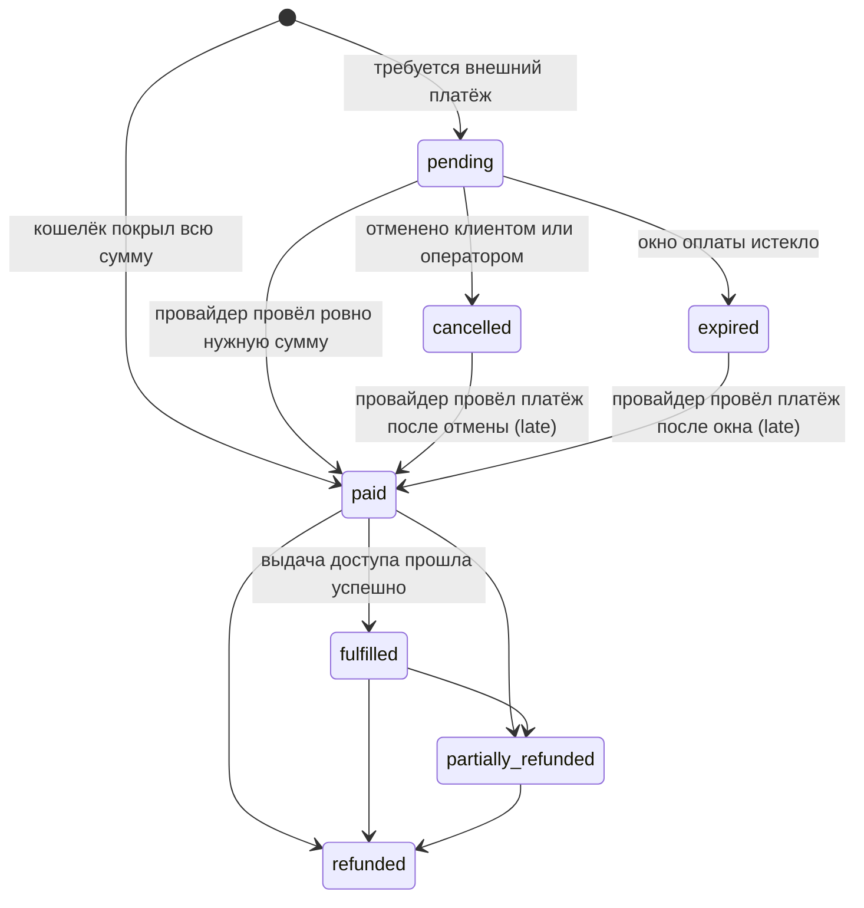

Каждая покупка в Omniflow — это строка в `orders`. Подписка, смена тарифа, пополнение кошелька,
дополнение в середине периода, подарок, покупка цифровых товаров и автоматическое продление
используют одну и ту же запись, одни и те же платёжные намерения, один и тот же приём вебхуков,
одну и ту же сверку и один и тот же путь возврата. Альтернатива — второй денежный путь для
пополнений, третий для магазина — была бы вторым и третьим местом, где можно ошибиться с
идемпотентностью, и комментарии в миграциях говорят об этом там, где были добавлены операции
`topup` и `goods`.

Операции различаются только тем, что даёт проведение платежа: право на услугу, средства в кошельке,
строка выдачи товара или подарок, который можно получить. Всё, что происходит до этого момента, —
общее.

## Одна запись, девять операций

`orders.operation` называет, что именно покупается. Набор значений задан табличным CHECK, поэтому
неизвестную операцию вообще нельзя записать.

| Операция | Что покупает | Что даёт проведение платежа |
| --- | --- | --- |
| `purchase` | новую подписку | право на услугу + операцию исполнения |
| `upgrade` | переход на более крупный тариф | право на услугу согласно политике повышения тарифа |
| `downgrade` | переход на более мелкий тариф | право на услугу согласно политике понижения тарифа |
| `extension` | дополнительное время на текущем тарифе, запрошенное клиентом | право на услугу, продлённое от текущей даты окончания |
| `renewal` | то же самое, но списывается автоматически | право на услугу, продлённое от текущей даты окончания |
| `topup` | средства в кошельке | проводку-кредит в книге проводок и ничего больше |
| `addon` | ёмкость в середине периода на действующей подписке | ёмкость дополнения, включённую в право на услугу |
| `gift` | подписку, дополнение или средства для другого человека | подарок, готовый к получению |
| `goods` | Telegram Premium или Stars | одну строку выдачи товара |

`renewal` намеренно выделен из `extension`. Поддержка отвечает на вопрос «за что с меня списали?»
именно по этому столбцу, и честный ответ различается для изменения, о котором клиент попросил сам,
и для списания, которое произошло, пока он спал. См. [Регулярные
платежи](/ru/commerce/recurring-payments).

### Суммы в заказе

| Столбец | Значение |
| --- | --- |
| `subtotal_minor` | цена тарифа плюс строки дополнений либо запрошенная сумма пополнения |
| `discount_minor` | скидка по акции, никогда не больше подытога |
| `wallet_minor` | средства, взятые из кошелька клиента |
| `external_minor` | сумма, которую должен провести платёжный провайдер |
| `paid_minor` | кошельковая часть плюс то, что фактически провёл провайдер |
| `refunded_minor` | возвращено на текущий момент, никогда не больше `paid_minor` |

Несущее ограничение — `wallet_minor + external_minor = subtotal_minor - discount_minor`. Это
табличный CHECK, а не правило приложения, поэтому ни скрипт, ни бэкфилл, ни будущий код не смогут
записать заказ, части которого не сходятся. Все суммы — целые числа в минорных единицах с валютой
из трёх заглавных букв; ни на проводе, ни в схеме нет ни одного числа с плавающей точкой.

## Автомат состояний

У заказа восемь состояний.



Три вопроса, которые состояния держат порознь: взяты ли деньги (`paid`), выдано ли купленное
(`fulfilled`) и отданы ли деньги обратно (`partially_refunded`, `refunded`). Исполнение вынесено в
отдельное от оплаты состояние, потому что выдача доступа в Remnawave — асинхронная операция с
повторными попытками, которая может провалиться уже после того, как деньги пришли; см.
[Исполнение](/ru/commerce/fulfillment).

`draft` есть и в схеме, и в домене, но все создатели заказов в коде пишут сразу `pending` или
`paid`, поэтому клиент его обычно не увидит.

<Note>
  Домен объявляет карту разрешённых переходов, но в продакшене её никто не вызывает. Жизненный
  цикл на самом деле обеспечивает набор проверок, разбросанных по запросам, которые записывают
  каждый переход; они перечислены ниже. Не читайте диаграмму как единый шлюз, через который
  проходит каждая запись.
</Note>

| Переход | Кем записывается | Проверка |
| --- | --- | --- |
| → `pending` | создание заказа | заказу нужен внешний платёж (`external_minor > 0`) |
| → `paid` при создании | создание заказа | `external_minor = 0`, кошелёк покрыл всё |
| `pending` → `paid` | путь проведения платежа | строка заказа заблокирована `FOR UPDATE`, а платёж классифицирован как проводящий заказ |
| `cancelled` / `expired` → `paid` | путь проведения платежа | та же блокировка; платёж классифицирован как `paid_after_cancellation` или `late` |
| `paid` → `fulfilled` | воркер исполнения или применение дополнения | успешный `create` в Remnawave либо применённая ёмкость дополнения |
| → `cancelled` | запрос отмены | текущее состояние — `draft`, `pending` или уже `cancelled` |
| → `expired` | чистка истёкших заказов | `state IN ('draft','pending') AND expires_at <= now()`, `FOR UPDATE SKIP LOCKED` |
| → `partially_refunded` / `refunded` | регистратор возвратов | суммарный возврат равен `paid_minor` ⇒ `refunded`, иначе `partially_refunded` |

Отмена идемпотентна: запрос принимает `cancelled` как исходное состояние, а строка мутации
записывается через upsert по `(order_id, action, idempotency_key)`, поэтому двойное нажатие
закрывает один заказ один раз.

**Закрытый заказ всё ещё можно оплатить.** Чекаут провайдера живёт дольше открывшего его заказа:
счёт CryptoBot или страница YooKassa, оставленная в другой вкладке, принимает деньги после того, как
клиент нажал **Отменить**, а ручной перевод можно подтвердить после окна. Пришедшие деньги — это
деньги, которые клиент отправил, поэтому платёж, совпадающий с `external_minor`, проводит заказ —
право на услугу создаётся, а выдача доступа ставится в очередь ровно так же, как при обычной
продаже, — но классифицируется отдельно: `late` на истёкшем заказе, `paid_after_cancellation` — на
отменённом. Второй случай ещё и ставит в очередь операторское уведомление, потому что клиенту было
сказано, что ничего списано не будет.

Путь отмены снижает частоту таких случаев, отзывая открытые платёжные намерения заказа у провайдера
там, где адаптер это умеет: CryptoBot удаляет счёт, а ручное намерение просто закрывается. Ссылку на
счёт Telegram Stars отозвать нельзя, а у платежа YooKassa с немедленным захватом отменять нечего,
поэтому такие намерения остаются открытыми и полагаются на правило позднего проведения. Отзыв
выполняется по мере возможности — отказ провайдера никогда не блокирует саму отмену, — а намерение,
которое провайдер всё же отозвал, помечается `cancelled` с платёжным событием `status_changed`.

### Окно оплаты

`expires_at` задаётся при создании заказа и зависит от платёжного провайдера:

| Провайдер | Окно | Почему |
| --- | --- | --- |
| CryptoBot, YooKassa, Telegram Stars или ещё не выбран | 1 час | размещённый у провайдера чекаут оплачивают за минуты или бросают, а открытый заказ держит резерв в кошельке |
| `manual` | 72 часа | банковский перевод приходит, когда его обработает банк, а оператор подтверждает его, когда в следующий раз заглянет; три дня покрывают выходные |
| заказ цикла автопродления | 76 часов | все попытки расписания дозвона проводят один и тот же заказ — см. [Регулярные платежи](/ru/commerce/recurring-payments) |
| `goods` | срок действия котировки шлюза | цену назвал шлюз доставки, и платить по ней после истечения котировки нельзя |

Поверхность, которая знает провайдера в момент открытия заказа, называет его, и окно верно с самого
начала. Поверхность, которая даёт клиенту выбрать провайдера потом, открывает заказ с часовым окном
по умолчанию, а создание платёжного намерения затем расширяет окно до того, которого заслуживает
выбранный провайдер. Расширение только удлиняет окно, только пока заказ в `pending`, и никогда не
трогает заказ на товары, поэтому закрытый заказ никогда не открывается заново, а просроченная
котировка никогда не оплачивается. Выбор карточного провайдера после ручного оставляет более длинное
окно в силе.

<Warning>
  Чистка истёкших заказов, сгорание средств в кошельке и чистка сохранённых корзин выполняются в
  одном цикле, который запускает только процесс API. Установка, развёрнутая как бот плюс воркер без
  процесса API, никогда не переводит ожидающий заказ в `expired`, никогда не сжигает средства в
  кошельке и никогда не чистит корзины.
</Warning>

## Что видит клиент: фаза платежа

Ни одна из клиентских поверхностей не показывает сырое состояние заказа. Состояние заказа, статус
платёжного намерения и статус последней операции исполнения сворачиваются на сервере в одну фазу,
потому что только сервер видит все три сразу.

| Фаза | Значение |
| --- | --- |
| `awaiting_action` | провайдер ждёт действия от клиента |
| `pending` | платёж у провайдера, и он его ещё не провёл |
| `succeeded` | намерение проведено, а заказ ещё не догнал его |
| `provisioning` | оплачено, выдача доступа в Remnawave выполняется или повторяется |
| `completed` | оплачено и выдано |
| `failed` | платёж не прошёл либо выдача доступа окончательно провалилась |
| `cancelled` / `expired` | заказ закрылся без списания |
| `refunded` | по заказу зарегистрирован возврат |

Сначала смотрят на заказ и только потом на намерение — именно это не даёт опоздавшему или
продублированному вебхуку провайдера откатить оплаченный заказ назад у кого-то на экране.

- **Веб.** `/account/orders/{id}` рисует трёхшаговый индикатор прогресса — оплачено, выдача
  доступа, готово, — управляемый только фазой, поэтому перезагрузка или вторая вкладка показывают
  тот же прогресс.
- **Telegram.** Экран заказа переключается по той же фазе и предлагает свою клавиатуру для каждой
  фазы: ссылку провайдера и **Отменить**, пока заказ ожидает оплаты, **Подключить** — после
  завершения.

`GET /v1/account/orders` и `GET /v1/account/orders/{orderID}` возвращают `phase` рядом с `state`.
Принадлежность заказа зашита в сам SQL (`WHERE o.id = $3 AND o.user_id = $1`), поэтому
идентификатор заказа, подсмотренный в URL или в callback-данных, не позволит обратиться к чужому
заказу, а «не ваш» неотличимо от «не существует».

<Note>
  Список заказов клиента намеренно исключает пополнения: он требует строку в `order_lines`, а у
  пополнения её нет. Страница самого заказа-пополнения по-прежнему доступна по идентификатору —
  именно на неё ведёт ссылка с экрана кошелька.
</Note>

## Расчёт цены при оформлении заказа

Одна функция ценообразования обслуживает и предпросмотр, и заказ, который за ним следует.
Предпросмотр выполняет её внутри транзакции, которая всегда откатывается, поэтому просмотр цены не
может ни погасить акцию, ни зарезервировать средства в кошельке; подтверждение выполняет ту же
функцию внутри сериализуемой транзакции, которая записывает заказ, поэтому показанные и сохранённые
цифры не могут разойтись.

Шаги по порядку:

1. Определить версию тарифа для запрошенной валюты. Архивированная версия, снятая с продажи версия
   или версия без цены в этой валюте даёт `plan_unavailable`.
2. Сверить операцию с политиками повышения и понижения тарифа.
3. Прочитать доступный баланс кошелька — общую сумму минус то, что уже заняли собственные заказы
   клиента в состояниях `draft` и `pending`.
4. Определить акцию, если код был указан, взяв `FOR UPDATE` на строку акции, чтобы два клиента,
   гонящиеся за последним использованием ограниченного кода, выстроились в очередь, а не получили
   его оба.
5. Разрешить выбор сквадов по политике выбора, заданной версией тарифа.
6. Оценить дополнения по полной каталожной цене, потому что дополнение, купленное вместе с тарифом,
   покрывает весь первый период.
7. Разделить сумму к оплате на кошельковую часть и внешнюю часть.

Отклонённый промокод не ломает оформление заказа. `POST /v1/account/checkout/promo` отвечает **200**
с полем `promoRejection`, а не ошибкой, и расчёт пересчитывается без кода, поэтому клиент может
попробовать другой, не потеряв корзину. Устойчивые причины отказа — `promo_unknown`,
`promo_ineligible`, `promo_exhausted`, `promo_invalid` и — для магазина — `promo_below_cost`. См.
[Каталог и акции](/ru/commerce/catalog-promotions).

На маршруте заказов с bearer-токеном попытки применить промокод ограничены десятью в минуту на
клиента через Valkey. Если сам ограничитель недоступен, запрос отвечает `503`, потому что
пропускать всё при отказе ограничителя акций — это способ подобрать код перебором.

## Средства кошелька списываются раньше внешнего платежа

```text
due      = subtotal - discount
wallet   = min(available balance, due)
external = due - wallet
```

Разделение сохраняется в заказе, а не пересчитывается при проведении платежа, — именно поэтому
движение в книге проводок в точности воспроизводит то, что подтвердил клиент. Доступный баланс
вычитает средства, уже занятые собственными неоплаченными заказами клиента: без этого два
оформления, открытых рядом, оба считали бы одни и те же деньги своими.

Заказ, цену которого полностью покрывает кошелёк, создаётся сразу в состоянии `paid` и проводится
внутри создающей его транзакции. Такому заказу вообще не предлагается платёжный провайдер: попытка
начать по нему платёж отвечает `409 payment_not_required`.

Оформление заказа несёт переключатель **использовать кошелёк** на обеих поверхностях
(`PATCH /v1/account/checkout` с `{"applyWallet": false}` в браузере, кнопка переключения кошелька в
боте) — для клиента, который предпочитает сохранить баланс на потом.

При проведении платежа баланс перечитывается. Если с момента подтверждения он опустился ниже
`wallet_minor` заказа, платёж классифицируется как `wallet_unavailable`, и заказ **не** проводится.
Что после этого остаётся, описано в разделе [Когда платёж не
проводится](#когда-платёж-не-проводится). Механика кошелька целиком описана на странице [Кошелёк и
книга проводок](/ru/commerce/wallet-ledger).

## Сессия оформления заказа

У клиента не больше одного открытого оформления заказа, общего для браузера и чата: это
обеспечивает частичный уникальный индекс по клиенту, поэтому открытие оформления в браузере
вытесняет то, что осталось открытым в Telegram, а не работает рядом с ним. Сессия несёт версию
тарифа, операцию, валюту, выбранного провайдера, промокод и причину его отклонения, переключатель
кошелька, целевую подписку, выбранные сквады и один ключ идемпотентности, выпущенный при открытии
оформления и переиспользуемый при каждой попытке подтверждения. Именно поэтому второе нажатие,
дважды отправленная форма или повтор после оборвавшегося соединения приводят к уже существующему
заказу.

<Steps>
  <Step title="Откройте оформление заказа">
    На `/account/store` выберите тариф и нажмите **Купить**. Это `POST /v1/account/checkout` с
    `{planVersionId, operation, subscriptionId?, newSubscription?}`.
  </Step>
  <Step title="Отредактируйте его">
    `/account/checkout` показывает разбивку суммы. Любое изменение — это
    `PATCH /v1/account/checkout` с любым из полей `provider`, `currency`, `applyWallet`,
    `subscriptionId`, `newSubscription`, `squadIds`; каждое из них — JSON-указатель, поэтому «не
    передано» и «очищено» — разные запросы. Дополнения переключаются на
    `POST /v1/account/checkout/addons/{addonVersionID}`, промокоды — на
    `POST`/`DELETE /v1/account/checkout/promo`.
  </Step>
  <Step title="Подтвердите">
    **Подтвердить** отправляет `POST /v1/account/checkout/confirm` с заголовком `Idempotency-Key` и
    отвечает **201** с заказом. Здесь ничего не списывается.
  </Step>
  <Step title="Оплатите">
    **Оплатить** отправляет `POST /v1/account/orders/{orderID}/payment` с `{"provider": "..."}` и
    заголовком `Idempotency-Key` и возвращает способ передачи к оплате.
  </Step>
</Steps>

Подтверждение и оплата — намеренно разные шаги: клиент, закрывший вкладку между ними, обнаружит
ожидающий заказ, а не платёж, который никто не может объяснить.

Отказы, которые стоит знать:

- Каждый запрос на изменение требует, чтобы у оформления ещё не было заказа, поэтому правка,
  пришедшая после подтверждения, сообщается как `409 checkout_settled`, а не как отсутствующее
  оформление.
- Изменение жизненного цикла при нескольких подписках и без указанной цели отклоняется с
  `422 subscription_target_required`. Панель обязана спросить, а не позволять серверу угадывать.
- Валюта, которую выбранный адаптер не может провести, отклоняется в момент выбора.
- Оформление истекает через час после открытия; чтение истёкшего удаляет его, поэтому клиент
  начинает заново со свежего расчёта, а не с устаревшей цены.
- В Telegram членство в обязательных каналах перепроверяется в момент подтверждения, потому что
  клиент может выйти из канала между просмотром и оплатой.

## Платёжные намерения

Строка `payment_intents` — это одна попытка провести один заказ через одного провайдера. Она хранит
провайдера, статус (`pending`, `requires_action`, `processing`, `succeeded`, `failed`, `cancelled`,
`expired`), сумму и валюту, собственный референс провайдера, URL оплаты, ключ идемпотентности
вызывающей стороны, снимок объявленных возможностей адаптера и несекретные `receipt_metadata` — там
живут региональные поля фискализации, так что адаптер может их заполнить, не протаскивая поля
провайдера в модель заказа.

Создание намерения:

1. Ключ идемпотентности проверяется (от 8 до 128 символов).
2. Незарегистрированный провайдер отклоняется с «payment provider is not enabled».
3. Рекомендательная блокировка PostgreSQL по ключу `provider + ":" + key` выстраивает
   параллельные попытки в очередь.
4. Заказ должен быть в состоянии `pending` **и** иметь внешнюю сумму к оплате, иначе — «order does
   not require an external payment».
5. Существующее намерение под тем же ключом, но с другим заказом, суммой или валютой отклоняется с
   «idempotency key was already used with different payment parameters»; те же параметры возвращают
   намерение без изменений.
6. Если адаптер умеет находить счёт по референсу мерчанта (CryptoBot умеет), Omniflow подхватывает
   уже созданный им счёт, а не создаёт второй.
7. Иначе адаптеру поручается создать платёж, а его статус, референс и URL оплаты сохраняются.

| Вызывающая сторона | Ключ идемпотентности |
| --- | --- |
| Клиентский веб и Telegram | `order-{orderID}-{provider}` |
| Воркер продлений | `renewal:{cycleKey}:{attempt}` |
| `POST /v1/admin/orders/{orderID}/payments` | заголовок `Idempotency-Key` вызывающей стороны |

Привязка клиентского ключа к заказу **и** к провайдеру сделана намеренно: собственный ключ заказа не
различил бы клиента, который бросил один способ оплаты и вернулся с другим, а переиспользование
такого ключа связало бы вторую попытку с намерением первого адаптера.

Ответ несёт тип передачи к оплате, и каждый из них выводит свою формулировку, потому что для
читающего они означают разное:

| Тип передачи | Значение |
| --- | --- |
| `hosted` | есть страница, на которую нужно перейти |
| `telegram_invoice` | счёт приходит в чат |
| `manual` | оператор подтвердит перевод |
| `none` | кошелёк уже всё покрыл, платить нечего |

## Контракт провайдера

Каждый адаптер реализует один интерфейс: имя, возможности, создание, опрос, возврат, проверка
вебхука. Его уточняют четыре необязательных интерфейса — списать с сохранённого способа оплаты,
найти счёт по референсу мерчанта, ограничить валюты расчётов и проверить учётные данные, не двигая
деньги. Возможности — это `{refunds, partialRefund, recurring, webhooks, polling}`; они снимаются
снимком в каждое созданное адаптером намерение, поэтому изменившаяся позже возможность не может
переписать историю того, чем было намерение.

| Адаптер | Валюты | Вебхуки | Опрос | Возвраты | Регулярные платежи |
| --- | --- | --- | --- | --- | --- |
| `telegram_stars` | только `XTR` | нет (проводится из собственного потока обновлений бота) | нет | только полное списание и только когда известен платящий аккаунт Telegram | нет |
| `cryptobot` | 16 фиатных кодов | да, HMAC-SHA256 | да | нет | нет |
| `yookassa` | `RUB`, `USD`, `EUR` | да, без подписи, проверяются повторным запросом | да | полные и частичные | да |
| `manual` | любые | нет | нет | объявлены, проводятся решением оператора | нет |

`manual` и `telegram_stars` зарегистрированы всегда. `cryptobot` регистрируется, когда задан
`APP_CRYPTOBOT_TOKEN`; `yookassa` — когда заданы и идентификатор магазина, и секрет. Пустые учётные
данные оставляют адаптер незарегистрированным, вместо того чтобы зарегистрировать сломанный.

Способ оплаты предлагается клиенту, только если установка его настроила **и** у тарифа есть цена в
валюте, которую этот способ проводит. Порядок отображения задан фиксированной картой: Telegram
Stars, YooKassa, CryptoBot, затем manual.

<Warning>
  Поскольку адаптер `manual` зарегистрирован всегда и не имеет операторского переключателя, который
  бы его скрывал, каждая установка предлагает «manual» как способ оплаты каждому клиенту, включая
  те установки, которые никогда не собирались принимать банковские переводы. Подтвердить ручной
  платёж можно только через API с bearer-токеном, описанный в разделе [Ручные
  платежи](#ручные-платежи); экрана для этого нет.
</Warning>

Настройка каждого провайдера, учётные данные и URL вебхуков — на странице [Платёжные
провайдеры](/ru/integrations/payments).

## Приём вебхуков и идемпотентность

Обратные вызовы провайдеров принимает один публичный маршрут без аутентификации:
`POST /v1/payments/webhooks/{provider}`. Подлинность обеспечивает проверка подписи в адаптере, а не
учётные данные на маршруте; тело ограничено 1 МиБ (более крупное получает `413`).

1. Названный адаптер должен быть зарегистрирован **и** объявлять поддержку вебхуков. Именно это
   закрывает публичный маршрут для `telegram_stars` и `manual`: Telegram не подписывает обновления
   Bot API для публичного HTTP-маршрута, поэтому принимать там «вебхук Stars» означало бы принимать
   деньги без аутентификации.
2. Тело хешируется.
3. Адаптер проверяет подпись. При неудаче строка всё равно записывается — с
   `signature_valid = false` и идентификатором события, выведенным из дайджеста тела, —
   увеличивается `omniflow_provider_webhooks_total{outcome="signature_invalid"}`, и возвращается
   `400`.
4. Событие вставляется в `provider_webhook_events` по `(provider, provider_event_id)`. Если
   сохранённая строка уже читается как `processed` или `ignored`, запрос возвращает `duplicate` и
   останавливается. **Это и есть защита от дублей.**
5. Только для YooKassa упомянутый платёж перезапрашивается через аутентифицированный API, и
   полученные опросом статус и сумма заменяют то, что пришло в уведомлении: YooKassa не подписывает
   свои обратные вызовы, поэтому подлинность устанавливается прямым вопросом провайдеру.
   Неудавшийся перезапрос завершает строку как `failed` с `reconciliation_failed` и ничего не
   применяет.
6. Проверенное событие, которое не является успехом, завершается как `ignored`, а не как ошибка.
7. Намерение находится по референсу провайдера, с откатом на заказ, указанный в референсе мерчанта.
   Отсутствие совпадения завершает строку как `failed` с `payment_not_found`.
8. Платёж применяется через общий путь проведения, и строка завершается как `processed` с
   классификацией.

Сохранённая строка хранит сырое тело, его SHA-256 и **урезанную** проекцию заголовков — только
`content-type` и `user-agent`. Сохранение заголовка авторизации или подписи положило бы учётные
данные провайдера в базу; сохранение тела вместе с дайджестом — то, что делает спор разрешимым, а
повтор безопасным. Строки удаляются чисткой по срокам хранения через 30 дней после приёма.

Операторы могут посмотреть недавние события через `GET /v1/panel/system/webhooks`
(`system.read`).

<Warning>
  `POST /v1/panel/system/webhooks/{eventID}/replay` (`system.write`) сбрасывает статус сохранённой
  строки в `received`. Строки в состоянии `received` никто не потребляет — воркера повторной
  обработки нет, — поэтому пометка события на повтор фиксирует намерение и не применяет платёж
  заново. Для этого используйте сверку.
</Warning>

## Классификация платежей

Каждый проведённый провайдером платёж классифицируется относительно заказа, и каждая классификация
записывается в `payment_events` независимо от того, проводится заказ или нет. «С этим платежом
что-то не так» — это не одно условие, и такой словарь позволяет оператору поддержки прочитать, что
произошло, а не выводить это из двух значений статуса.

| Классификация | Условие | Заказ проводится? |
| --- | --- | --- |
| `paid` | сумма равна `external_minor`, платёж пришёл внутри окна оплаты | да |
| `late` | сумма совпадает, но окно уже истекло либо заказ уже был в `expired` | да |
| `paid_after_cancellation` | сумма совпадает, но заказ уже был отменён | да, и оператор уведомляется |
| `duplicate` | заказ уже оплачен, исполнен или возвращён | нет |
| `underpayment` | пришло меньше, чем `external_minor` | нет |
| `overpayment` | пришло больше, чем `external_minor` (`paid_minor` всё равно записывается) | нет |
| `currency_mismatch` | валюта платежа отличается от валюты заказа | нет |
| `wallet_unavailable` | платёж прошёл бы, но баланс кошелька опустился ниже зарезервированной заказом суммы | нет |

`payment_events.type` — закрытый набор, и отображение переименовывает `paid` в `status_changed`,
`currency_mismatch` — в `amount_mismatch`, а `paid_after_cancellation` — в `late`; `details` каждого
события несёт классификацию и состояние заказа до платежа, поэтому лента по-прежнему отличает поздний
платёж от платежа, попавшего на отменённый заказ. Строка уникальна по
`(payment_intent_id, provider_event_id, type)` с трактовкой NULL как совпадающих значений, поэтому
одно и то же событие провайдера не может добавить одну и ту же запись дважды.

**Пополнения — исключение.** Пополнение не обязано ничем, кроме самих денег, поэтому переплата или
недоплата при `operation = 'topup'` принудительно считается `paid`, а на кошелёк зачисляется ровно
то, что пришло. Расхождение всё равно записывается платёжным событием и всё равно попадает в
операторское уведомление о пополнении.

### Когда платёж не проводится

Классификация, не приводящая к проведению, всё равно фиксируется. Платёжное событие сохраняется
надёжно, а заказ остаётся в своём состоянии, поэтому ничего не теряется молча.

Каждая из них — `duplicate`, `underpayment`, `overpayment`, `currency_mismatch` и
`wallet_unavailable` — также ставит в очередь операторское уведомление в той же транзакции, вида
`incident`, с заказом, провайдером, классификацией и классом суммы. Оно дедуплицируется по платёжному
намерению и классификации, поэтому повторно присланный вебхук ничего не добавляет. То же уведомление
ставится для `paid_after_cancellation`, которая заказ проводит. См.
[Операторские уведомления](/ru/operations/operator-notifications).

<Warning>
  `wallet_unavailable` — тот случай, который требует оператора больше всего. Провайдер взял деньги по
  заказу, который остаётся в `pending`, и ничто не разрешает это автоматически. Он виден в ленте
  событий заказа в `/admin/finance/{orderId}` и в
  `omniflow_payments_total{classification="wallet_unavailable"}`. Разрешить его означает либо
  зачислить разницу обратно на кошелёк корректировкой, либо вернуть платёж провайдера. `underpayment`
  или `overpayment` по заказу подписки точно так же оставляет деньги у провайдера и разрешается тем же
  способом.
</Warning>

## Проведение: что даёт оплаченный заказ

Проведение выполняется внутри транзакции, записавшей платёж, и ветвится по операции.

| Операция | Что производит |
| --- | --- |
| `topup` | только средства в кошельке. Ни права на услугу, ни реферальной квалификации |
| `addon` | движение выручки, ёмкость дополнения, включённую в действующее право на услугу, одну операцию исполнения `set_limits`, заказ переводится в `fulfilled` |
| `goods` | движение выручки и одну строку выдачи товара. В Remnawave ничего не отправляется |
| `gift` | движение выручки и подарок, помеченный как готовый к выдаче. Для покупателя — ничего |
| всё остальное | полный путь подписки, описанный ниже |

Путь подписки по порядку:

1. Двойная проводка движения выручки.
2. График права на услугу вычисляется из операции и политик тарифа: покупка начинается сейчас;
   продление по запросу или автоматическое заканчивается в `max(сейчас, текущее окончание) +
   длительность`; повышение тарифа либо заменяет, либо складывается; понижение вступает в силу
   немедленно или в момент текущего окончания.
3. Право на услугу создаётся с набором сквадов, подтверждённым клиентом, с откатом на собственный
   набор версии тарифа.
4. Применяются строки дополнений, идемпотентно по заказу и версии дополнения.
5. Создаётся операция исполнения с ключом `order:{orderID}:fulfill` и желаемым состоянием в
   Remnawave.
6. Записывается строка `outbox_events` с темой `order.paid`.
7. В очередь ставится операторское уведомление, дедуплицированное по заказу.
8. Реферальные вознаграждения начисляются в этой же транзакции, поэтому повторный вебхук никогда не
   начислит их дважды.

Смысл того, что всё это делается в одной транзакции, в том, что движение в книге проводок, право на
услугу, операторское уведомление и надёжно сохранённое намерение на выдачу доступа фиксируются
вместе или не фиксируются вовсе. Именно это делает «успех платежа и надёжное намерение на
исполнение фиксируются вместе» инвариантом, а не соглашением о порядке действий.

<Note>
  Строка `outbox_events` записывается, но никогда не помечается опубликованной: сегодня ни один
  процесс в репозитории не выставляет `published_at`. Считайте эту таблицу внутренней записью о
  том, что было проведено, а не лентой событий, на которую можно подписаться.
</Note>

Два намеренных исключения:

- Дополнение в середине периода, чья подписка исчезла между покупкой и проведением, **не**
  откатывает деньги. Заказ остаётся оплаченным, записывается событие журнала аудита
  `addon.no_active_entitlement` с категорией `financial` и исходом `failure`, и в очередь ставится
  операторское уведомление. Автоматический возврат означал бы решение за клиента о том, чего он
  хотел.
- Сохранённая корзина, освобождённая проведённым пополнением, оплачивается **после** коммита,
  потому что сбой корзины никогда не должен откатывать полученный платёж. См. [Пополнение кошелька
  и сохранённые корзины](/ru/commerce/wallet-topup-cart).

## Ручные платежи

У адаптера `manual` нет внешней системы: он возвращает намерение в состоянии `requires_action`,
референс провайдера у которого — идентификатор заказа, а проведение происходит, когда оператор его
подтверждает. Он существует для банковских переводов, наличных и любого канала, который Omniflow не
интегрирует, а подтверждение попадает в журнал аудита, поэтому деньги привязаны к конкретному
оператору и к причине.

```bash
curl -X POST https://example.com/v1/admin/payments/{paymentID}/manual-decision \
  -H "Authorization: Bearer $APP_OPERATOR_TOKEN" \
  -H "Idempotency-Key: manual-2026-08-13-0001" \
  -H "Content-Type: application/json" \
  -d '{"approved": true, "operatorID": "ops@example.com", "reason": "Bank transfer received"}'
```

Решение отклоняется без оператора, причины и корректного ключа идемпотентности, а также если
намерение не является ручным. Оно хранится уникально на каждое намерение, поэтому второе решение,
расходящееся с первым, отклоняется с «manual payment already has a different final decision».
Подтверждение проводит **всю** сумму намерения; отказ фиксирует решение и не проводит ничего.

Пока решение ожидается, клиент видит передачу к оплате типа `manual` и сообщение о том, что оператор
подтвердит платёж. Заказ остаётся оплачиваемым семьдесят два часа с момента создания ручного
намерения — см. [окно оплаты](#окно-оплаты), — а подтверждение даже после этого окна всё равно
проводит его с классификацией `late`.

## Возвраты

История платежей никогда не переписывается. Возврат — это новая строка в `refunds` плюс новая
сбалансированная транзакция в книге проводок, поэтому запись о том, что было списано, сохраняется
нетронутой.

<Warning>
  Деньги на самом деле возвращает ровно один эндпоинт:
  `POST /v1/admin/payments/{paymentID}/refunds`, на поверхности с bearer-токеном. Собственная форма
  **Вернуть** в панели на `/admin/finance/{orderId}` отправляет
  `POST /v1/panel/finance/orders/{orderID}/refund`, который записывает событие журнала аудита
  `panel.refund.issued` и больше ничего: ни вызова провайдера, ни строки в `refunds`, ни движения в
  книге проводок, ни смены состояния заказа. Считайте форму в панели фиксацией решения оператора, а
  сам возврат выполняйте через API.
</Warning>

Рабочий путь по шагам:

- Отказать при отсутствии корректного ключа идемпотентности **и** непустой причины.
- Взять рекомендательную блокировку `refund:{paymentIntentID}`, чтобы изменения возвратов по одному
  намерению выстраивались в очередь.
- Отказать, если намерение не в состоянии `succeeded`, если валюта не совпадает или если сумма не
  положительна либо превышает сумму намерения.
- Отказать, если адаптер не зарегистрирован, не объявляет поддержку возвратов или у намерения нет
  референса провайдера. Поэтому CryptoBot нельзя вернуть вообще.
- Просуммировать уже имеющиеся у намерения возвраты в состояниях pending, processing и succeeded и
  отказать, если этот возврат уведёт сумму за размер намерения, — **до** обращения к провайдеру,
  потому что с провайдером, который принял избыточный возврат, потом придётся спорить.
- Вызвать адаптер, записать строку в `refunds` (уникальную по намерению и ключу идемпотентности) и
  — только если провайдер сообщил об успехе — зафиксировать движение в книге проводок и новое
  состояние заказа.

Регистрация возврата блокирует заказ, выходит сразу, если транзакция книги проводок под этим ключом
уже существует, и отказывает, если валюта отличается или если суммарный возврат превысил бы
**внешнюю** сумму. Поэтому кошельковую часть заказа нельзя вернуть провайдеру: у провайдера её
никогда не было. Заказ становится `refunded`, когда суммарный возврат достигает `paid_minor`, и
`partially_refunded` во всех остальных случаях; в очередь ставится операторское уведомление.

Ограничения конкретных провайдеров:

- **Telegram Stars** возвращает всё списание целиком или ничего и требует платящий аккаунт
  Telegram, который записывается только тогда, когда платёж был начат с поверхности, которая его
  знает. Платёж Stars, начатый в веб-панели, не несёт идентификатора Telegram и не может быть
  возвращён через адаптер.
- **CryptoBot** не имеет API возвратов.
- **YooKassa** поддерживает полные и частичные возвраты.
- **Manual** возвращает запись возврата в состоянии ожидания; деньги движутся так, как их отправил
  оператор.

Клиенты видят возвраты только для чтения: `GET /v1/account/orders/{orderID}` включает до десяти
возвратов по намерениям заказа. Отмена — единственное изменение заказа, доступное клиенту, и после
состояния `pending` она отклоняется с `409 order_not_cancellable`.

## Сверка и зависшие платежи

Вебхук может потеряться, задержаться или быть заблокирован файрволом, поэтому Omniflow ещё и сам
спрашивает провайдеров, что произошло. Поскольку сверка применяет полученный ответ через тот же
идемпотентный путь проведения, она может работать рядом с вебхуком, не начисляя дважды.

| Точка входа | Кто запускает |
| --- | --- |
| Фоновый сверщик | процесс API, каждую минуту, до 100 намерений |
| `POST /v1/account/orders/{orderID}/refresh` | клиент, а также экран заказа в Telegram при открытии |
| `POST /v1/admin/payments/{paymentID}/reconcile` | оператор, bearer-токен |

Сверщик выбирает намерения в состояниях `pending` или `processing`, принадлежащие `cryptobot` или
`yookassa`, имеющие референс провайдера и не тронутые в течение минуты. Сверка отказывает, если
адаптер не объявляет опрос; если удалённый статус — успех, платёж записывается с идентификатором
события `reconcile:{providerReference}`, а статус, референс и URL оплаты намерения обновляются в
любом случае.

Клиентская кнопка **Обновить** действует только в фазах `pending` или `awaiting_action` и
проглатывает ошибку неподдерживающего адаптера. Для Telegram Stars, который вообще нельзя
опрашивать, **Обновить** поэтому не делает ничего: платёж проводится из собственного потока
обновлений бота или не проводится вовсе.

`/admin/finance` → **Зависшие** перечисляет намерения, находящиеся в полёте больше двух часов, с
указанием их возраста.

<Warning>
  Кнопка **Сверить** в панели отправляет
  `POST /v1/panel/finance/payments/{paymentIntentID}/reconcile`, который записывает событие журнала
  аудита `panel.payment.reconciled` и не опрашивает провайдера. По-настоящему перезапрашивают
  провайдера фоновый сверщик, клиентская кнопка «Обновить» и маршрут с bearer-токеном выше.
</Warning>

## Что видит оператор

У `/admin/finance` три вкладки, потому что это один и тот же вопрос на трёх стадиях: деньги
ожидаемые, деньги зависшие, деньги, которые не пришли.

- **Заказы.** Фильтр по состоянию и операции, курсорная пагинация, экспорт в CSV. Столбцы: дата
  создания, клиент, операция, значок состояния, оплачено, возвращено. Строка открывает заказ.
  `GET /v1/panel/finance/orders` — право доступа `finance.read`.
- **Зависшие.** Очередь сверки, описанная выше.
- **Списания.** Неудачные попытки автоматического продления с номером попытки, источником средств,
  исходом и кодом ошибки. Это поверхность только для просмотра: отсюда ничто не перезапускает
  списание, потому что клиенту уже сказали продлить, и повторное списание по клику в панели было бы
  попыткой, о которой он не просил.

Страница заказа показывает все шесть сумм, каждое платёжное намерение с упорядоченной лентой
событий, каждый возврат, кнопку **Сверить** для каждого намерения и форму **Вернуть**, ограниченную
`paidMinor − refundedMinor` и требующую причину, — с учётом двух предупреждений выше. Сырое тело от
провайдера намеренно отсутствует: оно хранится для повтора и разбора спора и доступно через
диагностику вебхуков под собственным правом доступа.

Изменения из панели несут своё обоснование в заголовке `X-Operator-Reason`, а не в теле каждого
запроса; чтение требует `finance.read`, а сверка и возврат — `finance.write`. Права доступа
объявлены там, где монтируются маршруты, а не внутри обработчиков, поэтому добавленный ранний
return не может их обойти.

<Note>
  `renewal` отсутствует в фильтре операций финансового браузера, поэтому заказы продления нельзя
  отфильтровать по операции в `/admin/finance`, хотя столбец несёт это значение. Они всё равно
  видны без фильтра и попадают в экспорт CSV.
</Note>

Экспорт CSV отдаётся потоком как вложение с именем `orders.csv` со стабильным порядком столбцов:
более поздняя версия добавляет столбец в конец и никогда не вставляет его в середину:

```text
order_id, created_at_utc, updated_at_utc, customer_id, state, operation,
currency, subtotal_minor, discount_minor, wallet_minor, external_minor,
paid_minor, refunded_minor, providers
```

## Метрики

Деньги покрывают два счётчика, и оба маркируют только ограниченные наборы значений — идентификатор
никогда не становится меткой:

| Метрика | Метки |
| --- | --- |
| `omniflow_payments_total` | `provider`, `operation`, `classification` |
| `omniflow_provider_webhooks_total` | `provider`, `outcome` |

`outcome` — это либо `signature_invalid`, либо классификация проведения, поэтому серия отклонённых
подписей и серия повторных доставок оказываются двумя разными линиями на одном графике. См.
[Наблюдаемость](/ru/operations/observability).
