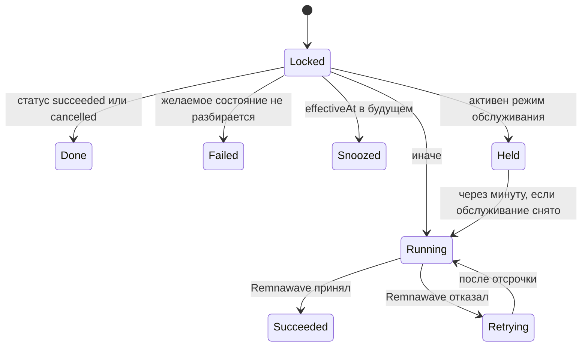

Omniflow снимает работу с пути запроса двумя разными способами, и эта разница важна, когда что-то застревает.

Работа, которая **касается одной записи** и должна пережить перезапуск, попадает в долговременную очередь: это River, работающий на той же базе PostgreSQL, причём строка задачи вставляется в той же транзакции, что и изменение состояния, которое эту задачу требует. Работа, которая представляет собой **проход по всей таблице** — просрочка заказов, зачистка корзин, обновление блок-листов, удаление вчерашних сессий, — выполняется обычными внутрипроцессными таймерами, потому что долговременная очередь добавила бы строку и политику повторов к тому, что таймер уже выражает безопасно.

Задачи выполняет только процесс `worker`. API и бот каждый создают клиент River для *вставки* и никогда не регистрируют воркера: закрытие заказа в любом из них — вебхук провайдера в API, оплата Telegram Stars или заказ, покрытый кошельком, в боте — вставляет задание выдачи доступа в платёжной транзакции.

## Долговременная очередь

Существует три очереди с фиксированной, вкомпилированной параллельностью:

| Очередь | Максимум воркеров | Что несёт |
| --- | --- | --- |
| `critical` | 16 | Оба вида задач — к моменту запуска любого из них клиент уже заплатил |
| `default` | 32 | Сегодня ничего |
| `bulk` | 8 | Сегодня ничего |

### Два вида задач

| Вид | Аргументы | Очередь | Максимум попыток | Уникальность |
| --- | --- | --- | --- | --- |
| `fulfillment` | `{"operationId": …}` | `critical` | 12 | Уникальна по аргументам |
| `goods_delivery` | `{"orderId": …}` | `critical` | 12 | Уникальна по аргументам |

Уникальность по аргументам и есть то, что заставляет дублирующую постановку в очередь — из переигранного вебхука, повторённого расчёта или двойного клика оператора — схлопнуться в уже существующую задачу, а не соревноваться с ней.

### Почему задача вставляется в оплачивающей транзакции

Правило, которому следует код, таково: долговременная задача ставится в очередь в той же транзакции PostgreSQL, что и изменение состояния, которое её требует. Расчёт заказа и вставка его задачи выдачи доступа коммитятся вместе — именно это делает истинным утверждение «у оплаченного заказа всегда есть ожидающая его задача». Альтернатива — рассчитать, зафиксировать, а потом поставить в очередь — оставляет окно, в котором процесс может умереть между двумя действиями, и тогда остаются заплативший клиент и очередь, которая о нём никогда не слышала.

Это же свойство делает безопасными повторы. Операция выдачи доступа несёт уникальный `idempotency_key`, поэтому доставка River «хотя бы один раз» не может применить её дважды, а повтор из панели ставит задачу в очередь под тем же самым ключом, а не создаёт вторую операцию.

### Схему очереди не создаёт ни одна миграция

River держит собственные таблицы (`river_job`, `river_leader`, `river_client`, `river_queue`, `river_migration`). Ничто в `database/migrations/` их не создаёт, ни один Go-файл не импортирует пакет `rivermigrate` из River, а сервис `migrate` в compose применяет только миграции Atlas самого Omniflow.

На базе, где этих таблиц нет, `client.Start` воркера падает, и процесс завершается с ненулевым статусом, залогировав `start River`. Вставки задач из API падают вместе с ним, что проявляется как оформление заказа, которое невозможно завершить.

<Warning>
  Это текущее состояние репозитория, а не конфигурация, которую вы пропустили. Пока миграция River не появилась, считайте схему очереди предварительным условием, которое вы обязаны обеспечить вне описанного пути развёртывания, и ожидайте, что воркер будет завершаться при старте, пока её нет.
</Warning>

## Задачи выдачи доступа

Задача `fulfillment` применяет одно желаемое состояние права на услугу к Remnawave. Это единственный путь, которым Omniflow пишет в панель, — поэтому каждый повтор, каждое удержание и каждый отказ ниже записывается в запись, которую оператор может прочитать потом. Коммерческая сторона этого описана в [Права на услугу и выдача доступа](/ru/commerce/fulfillment).

Воркер открывает сериализуемую транзакцию, блокирует строку операции, а затем:

- **Неразбираемое желаемое состояние** помечает операцию как `failed` с кодом `invalid_desired_state`, уведомляет операторов и отменяет задачу. Повтор провалился бы точно так же двенадцать раз подряд.
- **`effectiveAt` в будущем** откладывает задачу до этого момента, вместо того чтобы жечь попытки на запланированное изменение, срок которого ещё не наступил.
- **Режим обслуживания** паркует операцию в состоянии `retrying` с `last_error_code = maintenance_active` и откладывает задачу на минуту. Счётчик попыток при этом сначала уменьшается обратно, поэтому удержание не стоит ни одной единицы бюджета повторов, сколько бы окно ни длилось. См. [Режим обслуживания](/ru/operations/maintenance-mode).
- **Сбой провайдера** сохраняет классифицированный код ошибки и `next_attempt_at`, вычисленный как `5s × 2^attempt` с ограничением на восьмой попытке, — так что отсрочка идёт 10 с, 20 с, 40 с … вплоть до 1280 секунд между попытками.

Поддерживаемые операции — это `create`, `reconcile`, `extend`, `set_limits`, `set_squads`, `enable`, `disable` и `reset_traffic`. Всё остальное отменяет задачу, а не повторяет её.

После **трёх** неудачных попыток — и сразу же при постоянном сбое — воркер ставит в очередь уведомление оператору в топик `fulfillment_failure`, дедуплицированное по `operation:<id>`, так что одно мучающееся право на услугу порождает одно сообщение, сколько бы раз оно ни повторялось. Уведомление несёт идентификатор права на услугу, операцию, классифицированный код ошибки и статус — и никогда тело ответа Remnawave. См. [Уведомления оператора](/ru/operations/operator-notifications).

Операция `reconcile` дополнительно сравнивает локальное желаемое состояние с тем, что сообщает Remnawave, и записывает любое несовпадение как расхождение права на услугу (`missing_remote`, `expiry`, `traffic`, `device_limit`, `squads`, `status`). Успешное применение закрывает открытые расхождения по этому праву на услугу.

## Задачи доставки цифровых товаров

Задача `goods_delivery` передаёт один оплаченный заказ магазина его провайдеру. Гарантия, которую она обязана держать, — что оплаченный заказ отправляется **не более одного раза**, и форма воркера и есть эта гарантия:

1. Короткая транзакция блокирует строку доставки, отказывает во всём уже завершённом и заявляет следующую попытку — увеличивая счётчик и отодвигая крайний срок повтора *до* того, как будет вызван провайдер. Эта транзакция коммитится.
2. Вызов провайдера происходит вне какой-либо транзакции. Умерший здесь воркер оставляет строку, уже помеченную как отправленная, со сдвинутым сроком, поэтому ничто не подхватит её немедленно и не купит товар повторно.
3. Вторая транзакция записывает исход.

Источник истины о том, что причитается, — строка `goods_deliveries`, а не очередь. Двенадцать попыток River покрывают сбои, которые до провайдера так и не дошли, — короткий отказ базы данных, потерянное соединение, — тогда как собственный счётчик попыток строки управляет тем, сколько раз провайдера действительно спрашивают. Поэтому больший бюджет River не может превратиться в лишние покупки. Адаптер, возвращающий ошибку вместо классифицированного исхода, трактуется как неоднозначный сбой с кодом `adapter_error`, потому что «мы не знаем, состоялась ли покупка» — это не то же самое, что «она не состоялась».

Этот воркер существует, только когда на воркере задан `APP_DATA_ENCRYPTION_KEY`, поскольку без него учётные данные провайдера не распечатать. Без ключа воркер логирует `digital goods delivery disabled` и выполняет всё остальное.

<Note>
  Доставка цифровых товаров не инструментирована: она не открывает трассировочный спан и не пишет метрику задачи, поэтому `omniflow_jobs_total{kind="goods_delivery"}` не появляется никогда. Следите за ней через экраны магазина в панели, а не через Prometheus. См. [Наблюдаемость](/ru/operations/observability).
</Note>

## Очередь недоставленных задач, повторы и отмена

Операторских поверхностей две, и показывают они разное. Берите ту, которая нужна.

### Строки River, по bearer-токену

`GET /v1/admin/jobs` перечисляет реальные строки очереди и является единственным местом, где видна задача, которая так и не породила операцию выдачи доступа.

| Параметр | Значения |
| --- | --- |
| `state` | `dead_letter` (по умолчанию; discarded плюс cancelled), `retryable`, `running`, `available`, `scheduled`, `completed`. На всё остальное отвечает `400 invalid_state` |
| `limit` | 1–200, по умолчанию 50 |

Каждая строка возвращает идентификатор, вид, очередь, состояние, номер попытки и максимум попыток, время создания и последней попытки, счётчик ошибок и **последнюю ошибку, пропущенную через редактор**. Аргументы задачи резюмируются, а не воспроизводятся дословно, потому что они несут идентификаторы, место которым — за теми записями, на которые они указывают.

- `POST /v1/admin/jobs/{jobID}/retry` возвращает задачу в состояние available.
- `POST /v1/admin/jobs/{jobID}/cancel` отменяет её.

Любой из них отвечает `422 job_mutation_rejected`, когда текущее состояние задачи запрещает изменение, и оба отвечают `503 jobs_unavailable` в процессе, у которого нет клиента задач. Все три маршрута аутентифицируются через `APP_OPERATOR_TOKEN`; см. [Административный API](/ru/integrations/api).

### Операции выдачи доступа, в панели

`/admin/system` → **Jobs** (право доступа `system.read`) жёстко отфильтровано по неудавшимся операциям выдачи доступа — это и есть то представление недоставленных задач, которое оператору действительно нужно: время создания, операция, число попыток, код ошибки и идентификатор корреляции. Оно никогда не показывает ни полезную нагрузку провайдера, ни тело ответа Remnawave: статус, классификация и идентификатор корреляции — это ровно то, что нужно, чтобы решить, повторять ли, и ничто из этого не может вынести ссылку на подписку на экран оператора.

С правом `system.write`:

- **Retry** ставит ту же операцию в очередь заново под **тем же ключом идемпотентности**, так что воркер по-прежнему выполнит её ровно один раз.
- **Cancel** бросает операцию, которая не завершилась успехом.

**Успешную** операцию нельзя ни повторить, ни отменить, и этот отказ — `409 state_conflict`, обеспеченный в SQL, а не проверяемый в Go. Отзыв завершённой выдачи доступа кликом в панели оставил бы право на услугу и Remnawave в разногласии без записи о том, почему.

Каждая мутация в панели требует заголовка `X-Operator-Reason` и пишет событие аудита — `panel.fulfillment.retried` или `panel.fulfillment.cancelled`, категория `system`. История попыток по операции доступна по `GET /v1/panel/system/jobs/{operationID}/history` со статусом, идентификатором корреляции, кодом ошибки и временем каждой попытки; сохранённые сводки запроса и ответа намеренно не возвращаются никогда.

| Маршрут | Право доступа |
| --- | --- |
| `GET /v1/panel/system/jobs` | `system.read` |
| `GET /v1/panel/system/jobs/{operationID}/history` | `system.read` |
| `POST /v1/panel/system/jobs/{operationID}/retry` | `system.write` |
| `POST /v1/panel/system/jobs/{operationID}/cancel` | `system.write` |

## Циклы по расписанию, которые не являются задачами очереди

Это горутины, запускаемые тремя функциями `main`. Каждый проход — это зачистка всей таблицы, которую безопасно повторять и которая не несёт аргумента на отдельную запись, и каждый цикл независим: провалившийся проход логируется и никогда не останавливает остальные.

| Цикл | Процесс | Интервал | Настраивается | Что делает |
| --- | --- | --- | --- | --- |
| Обслуживание коммерции | api | 1 мин | нет | Просрочивает ожидающие заказы, гасит истёкшие начисления кошелька транзакцией двойной записи `expiration`, зачищает сохранённые корзины |
| Сверка платежей | api | 1 мин | нет | Переопрашивает до 100 незавершённых платёжных намерений |
| Контроллер режима обслуживания | api | `APP_MAINTENANCE_PROBE_SECONDS` (30 с) | да | Снимает пробы состояния зависимостей и двигает переключатель обслуживания |
| Телеметрический сигнал | api | 24 ч плюс один при старте | только вкл/выкл | Отправляет `installation.heartbeat` |
| Очистка коллектора | api (режим коллектора) | 24 ч | нет | Удаляет собранную телеметрию старше 180 дней |
| Планировщик выдачи доступа | worker | 15 мин | нет | Создаёт операции `reconcile` не более чем для 500 прав на услугу с ключом `reconcile:<entitlementID>:<15-minute bucket>` |
| Планировщик доставки товаров | worker | 30 с | нет | Ставит в очередь до 200 доставок, срок которых наступил |
| Продления и напоминания о неоплате | worker | 1 мин | нет | Списывает наступившие продления пакетами по 100 |
| Обходчик жизненного цикла | worker | 5 мин (аномалии 15 мин) | нет | Просрочивает подарки и персональные предложения, обновляет до 20 источников блок-листов, вычисляет правила аномалий |
| Раскрытие кампаний | worker | 1 мин | нет | Раскрывает аудитории кампаний, пакет 5 000 |
| Исполнитель массовых операций | worker | 15 с | нет | Применяет предпросмотренные массовые операции по одному элементу, пакет 50 |
| Очистка по срокам хранения | worker | `APP_RETENTION_INTERVAL_HOURS` (1 ч) | да | Семь шагов очистки, ниже |
| Резервное копирование по расписанию | worker | `APP_BACKUP_INTERVAL_HOURS` (24 ч) | да | Зашифрованный `pg_dump` плюс удаление старых копий |
| Членство в каналах | bot | 10 мин | нет | Перепроверяет обязательное членство в каналах, пакет 100 |
| Уведомитель операторов | bot | 10 с | нет | Привязывает топики форума, затем разбирает до 50 ожидающих уведомлений |

Бакетированный ключ идемпотентности у планировщика выдачи доступа стоит понять: два прохода внутри одного и того же пятнадцатиминутного бакета дают один и тот же ключ, поэтому перезапущенный воркер не может создать вторую операцию сверки для того же права на услугу в том же окне.

Два цикла отключаются, когда у воркера нет `APP_DATA_ENCRYPTION_KEY`, потому что оба читают запечатанные учётные данные: обновление блок-листов и вычисление аномалий в обходчике жизненного цикла, а также исполнитель массовых операций. Просрочка подарков и предложений при этом продолжает работать. Цикл членства в каналах отключается, когда не настроен ни один проверяющий членство.

<Warning>
  Ни один из этих циклов не берёт ни аренды, ни advisory-блокировки. River выбирает лидера для очередей, но второй контейнер `api`, `bot` или `worker` запускает вторую копию каждого цикла выше. По отдельности они идемпотентны, поэтому дублирование тратит работу впустую, а не портит состояние, — но поддерживаемая топология — это один экземпляр на роль. См. [Развёртывание](/ru/operations/deployment).
</Warning>

## Проходы очистки по срокам хранения

Ежечасный проход очистки удаляет одноразовые операционные данные. Он никогда не трогает финансовую историю, историю аудита, согласий, идентичностей и прав на услугу — она доступна только на добавление в течение всей жизни установки. Семь независимых шагов выполняются по порядку, и провалившийся шаг логируется и пропускается, чтобы одна заблокированная таблица не могла остановить очистку целиком.

| Шаг | Что удаляет | Окно |
| --- | --- | --- |
| `bot_sessions` | Истёкшие сессии бота | `expires_at` на уровне строки |
| `bot_checkout_sessions` | Истёкшие сессии оформления заказа, так и не ставшие заказом | `expires_at` на уровне строки |
| `provider_webhook_events` | Строки приёма вебхуков после их отметки хранения | `retain_until` на уровне строки |
| `support_attachments` | Истёкшие строки вложений, а также файлы за ними | на уровне строки |
| `outbox_events` | Опубликованные события | `APP_RETENTION_OUTBOX_DAYS` (7) |
| `telemetry_events` | Собранная телеметрия, по `received_at` | `APP_RETENTION_TELEMETRY_DAYS` (30) |
| `entitlement_drifts` | Расхождения, чей статус не `open`, по `resolved_at` | `APP_RETENTION_DRIFT_DAYS` (90) |

Шаг, который удалил строки, логирует `retention sweep removed rows` с таблицей и количеством.

Шаг с вложениями — тот, у которого есть особенность. Файлы вложений именуются по хешу их содержимого, поэтому один файл может стоять за несколькими строками, и только код, удаляющий строки, может определить, на какие файлы больше ничто не ссылается. Проход очистки читает ключи кандидатов *внутри* удаляющей транзакции, удаляет истёкшие строки, а затем убирает только те файлы, на которые не ссылается ни одна уцелевшая строка. Файл, который убрать не удалось, логируется и пропускается, а не проваливает весь проход. Без подключённого уборщика вложений — то есть в установке только с Telegram — воркер всё равно удаляет строки, потому что эти вложения являются ссылками на байты, которые держит Telegram.

<Warning>
  Если `APP_SUPPORT_ATTACHMENT_DIR` у воркера отличается от такового у API, очистка удалит строки и оставит байты на диске навсегда. Задайте обоим один и тот же общий путь и дайте ему том — см. [Развёртывание](/ru/operations/deployment).
</Warning>

Очистку по срокам хранения выполняет только воркер. Установка, где работают лишь `api` и `bot`, не убирает ничего из перечисленного.

## Транзакционный outbox

Три доменных события записываются в `outbox_events` в той же транзакции, что и изменение, которое они описывают, — так что у зафиксированного изменения состояния всегда есть его событие, а у откатившегося его никогда нет:

| Топик | Когда записывается |
| --- | --- |
| `order.paid` | Заказ рассчитан и создано его право на услугу |
| `wallet.credited` | Рассчитано пополнение кошелька |
| `addon.purchased` | Заказ дополнения рассчитан на право на услугу |

Отставание читают две поверхности. `GET /v1/admin/outbox` возвращает `{pendingCount, oldestAgeSeconds}`; вкладка **System → Outbox** в панели (право доступа `system.read`) перечисляет топик и возраст каждого ожидающего события и ничего больше, потому что полезная нагрузка outbox — это доменное событие, которое может называть клиента и сумму, а вопросу «работает ли публикатор» не нужно ни то, ни другое.

<Warning>
  **Outbox никто не рассылает.** Ни один код в Omniflow не выставляет `outbox_events.published_at`, и нет ни процесса-публикатора, ни подписчика, ни цели доставки. Отсюда прямо следуют два вывода. Число ожидающих событий растёт в течение всей жизни установки и никогда не падает, поэтому растущее число здесь — нормальное установившееся состояние, а не инцидент. И поскольку шаг очистки удаляет только строки, у которых `published_at` не null, `APP_RETENTION_OUTBOX_DAYS` не удаляет вообще ничего — таблица растёт неограниченно вместе со счётчиком.
</Warning>

`omniflow_outbox_pending_events` объявлена, но никогда не выставляется, поэтому этот датчик не является альтернативным представлением того же самого. Если хотите следить за размером таблицы, читайте счётчик из административного маршрута или из вкладки в панели.

## Связанные страницы

<CardGroup cols={2}>
  <Card title="Права на услугу и выдача доступа" icon="arrows-rotate" href="/ru/commerce/fulfillment">
    Что такое операция выдачи доступа и как работает восстановление после расхождений.
  </Card>
  <Card title="Наблюдаемость" icon="heart-pulse" href="/ru/operations/observability">
    Какие из этих задач дают метрику, а какие нет.
  </Card>
  <Card title="Режим обслуживания" icon="wrench" href="/ru/operations/maintenance-mode">
    Почему задача выдачи доступа может быть отложена, а не провалена.
  </Card>
  <Card title="Операции администратора" icon="sliders" href="/ru/operations/admin-operations">
    Остальные экраны System: вебхуки, расхождения и диагностика.
  </Card>
</CardGroup>
